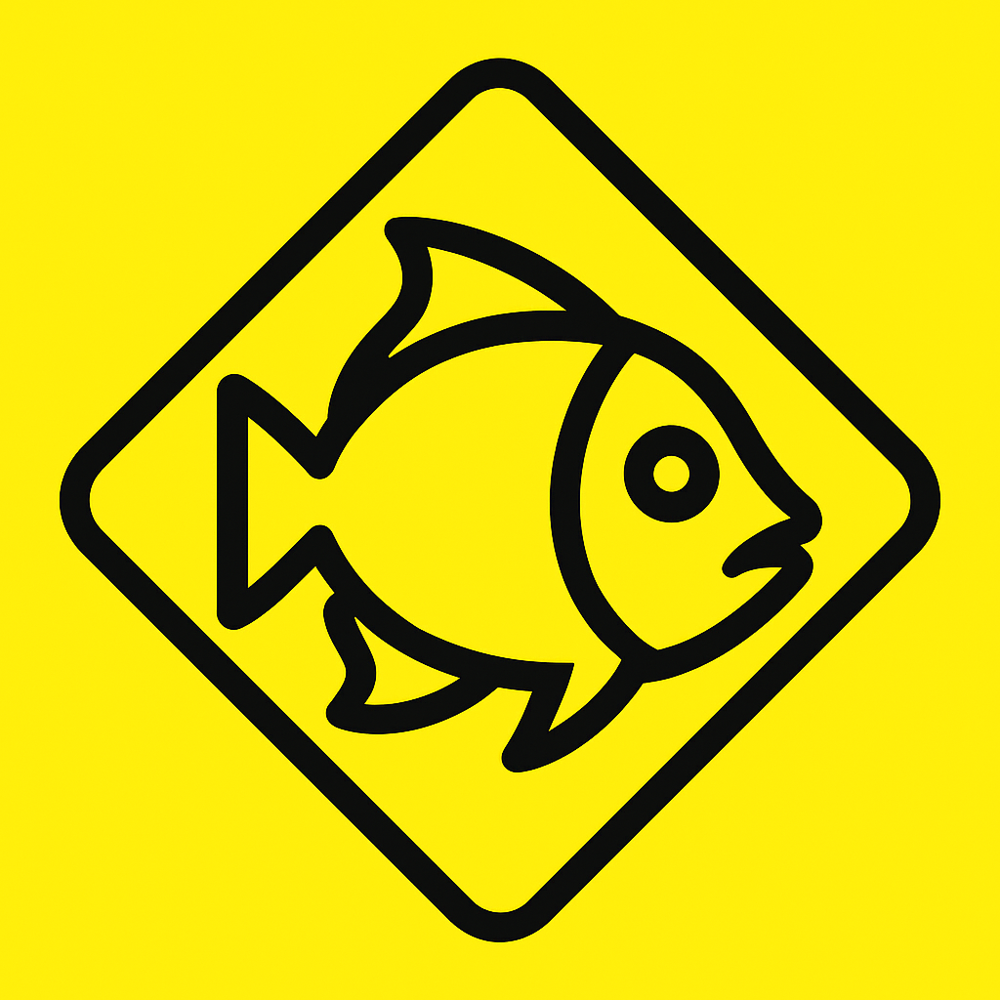

# Barberfish

A specialized Hammerhead Karoo extension designed for randonneuring cyclists, providing enhanced datafields and ride analytics.

 

## About the Name

The Barberfish lives in a symbiotic relationship with Hammerhead sharks, cleaning parasites and providing valuable services to their host. Similarly, this extension enhances your Hammerhead Karoo experience by providing specialized datafields and analytics that complement the core cycling computer functionality.

## Features

### Speed Analytics
- **Average Speed (Moving)** - Excludes paused time with color-coded indicators
- **Average Speed (Total)** - Includes paused time with color-coded indicators
- **Color Coding** - Red/green indicators based on configurable Paris Club Audax speed limits

### Time Management
- **ETA (Estimated Time of Arrival)** - Custom ddHddMdds formatting (e.g., 12H34M56S)
- **Paused Time** - Precise tracking with enhanced formatting

## Installation

1. Download the latest APK from the [Releases](../../releases) page
2. Install on your Hammerhead Karoo device
3. Configure the extension in the Karoo settings
4. Add Barberfish datafields to your ride screens

## Configuration

### Speed Limits
- **Minimum Speed**: Default 15 km/h (Paris Club Audax)
- **Maximum Speed**: Default 30 km/h (Paris Club Audax)
- **Custom Thresholds**: Configure your own speed ranges

### Display Options
- **Time Format**: ddHddMdds (hours, minutes, seconds)
- **Color Themes**: Match your Karoo display preferences

## Support

For issues, feature requests, or questions:
- Create an [issue](../../issues) on GitHub
