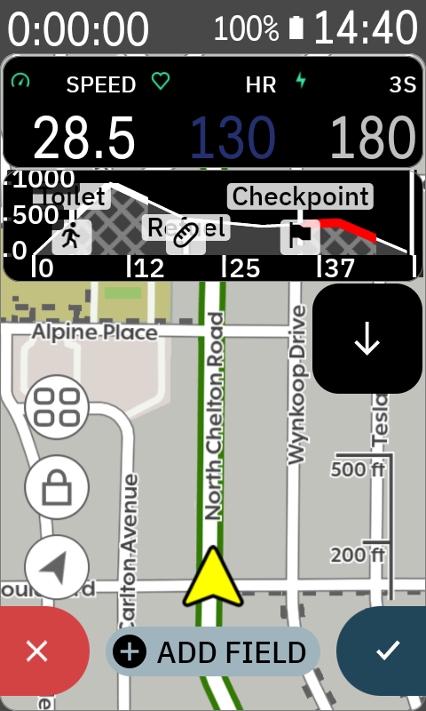
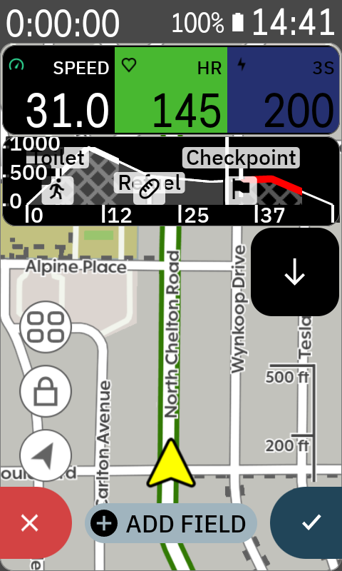
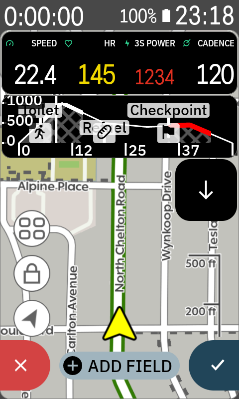
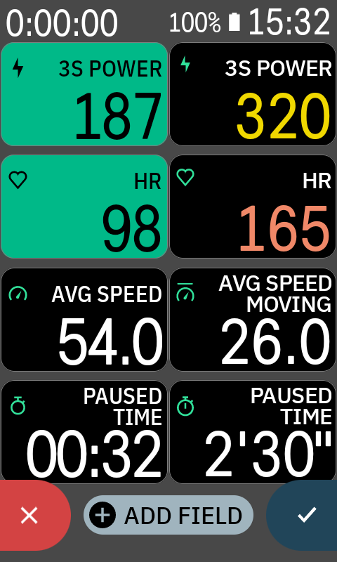
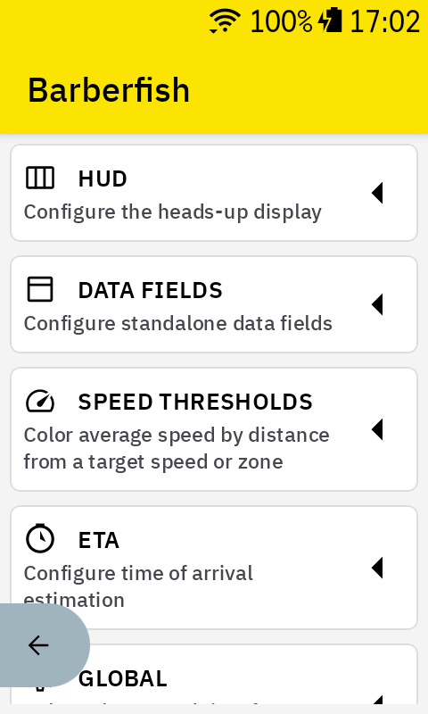
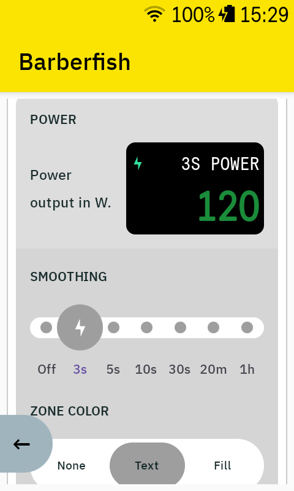
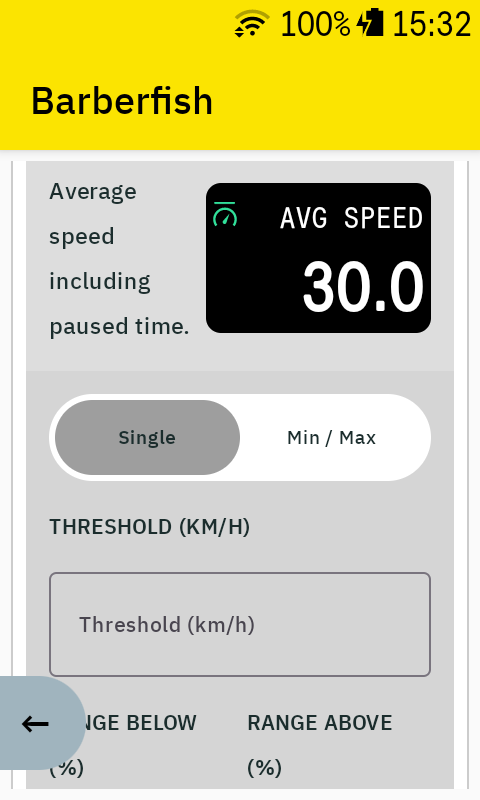
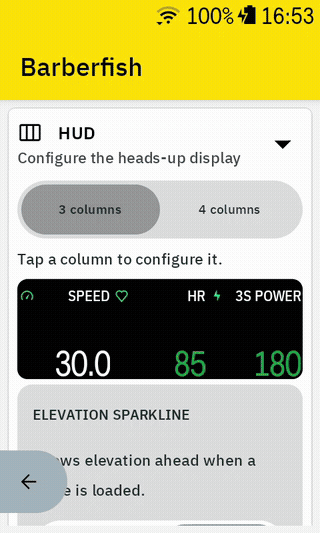
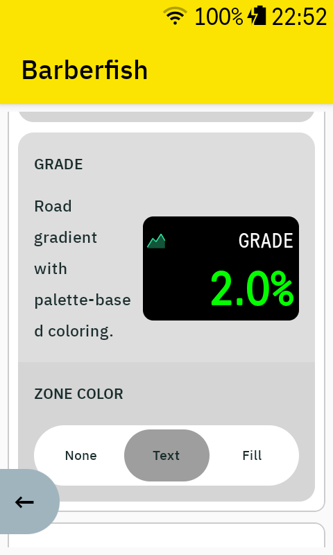

# Barberfish

[Barberfishes](https://en.wikipedia.org/wiki/Johnrandallia) keeps Hammerheads sharp, in [the ocean](https://www.instagram.com/reels/DEGADWAPPEy/) and on your bike.
Native-feeling data field enhancements for the [Hammerhead Karoo](https://www.hammerhead.io/).

 

## Description

Barberfish reimplements and enhances a core set of Karoo data fields with features the built-in fields don't offer. A configurable 3- or 4-column HUD shows any combination of speed, heart rate, power, cadence, average power, normalized power, or grade side by side with zone coloring. An optional color-coded elevation sparkline below the HUD shows the terrain profile when a route is loaded.

Zone coloring supports both background-fill and text-color styles across four palettes. Time fields use a consistent, unambiguous format across all durations. Average speed fields support a single target or a min/max range with threshold coloring. All fields are styled to match the native Karoo look and feel. Settings are configured through a Karoo-native config screen with live-updating field previews.

## Data field enhancements

| Feature             | Default Karoo                                                                                                                                                      | Barberfish                                                                                                                                           |
| ------------------- | ------------------------------------------------------------------------------------------------------------------------------------------------------------------ | ---------------------------------------------------------------------------------------------------------------------------------------------------- |
| HUD                 | Not available                                                                                                                                                      | 3- or 4-column layout; each slot selectable from the Barberfish data field collection with per-slot zone coloring                                    |
| Elevation sparkline | Not available                                                                                                                                                      | Color-coded strip below the HUD; only appears when a route is loaded; tap to cycle 5/10/20 km lookahead                                              |
| Zone color palettes | Karoo only                                                                                                                                                         | Karoo, Wahoo, Zwift, and Intervals.icu                                                                                                               |
| Zone coloring style | Background fill only                                                                                                                                               | Background fill or text color                                                                                                                        |
| Grade coloring      | Not available                                                                                                                                                      | Color-coded by road gradient steepness; Karoo, Wahoo, and Garmin palettes                                                                            |
| Grade smoothing     | Unknown                                                                                                                                                            | [EWMA](https://en.wikipedia.org/wiki/Exponential_smoothing) with α=0.15 (~6 s time constant) to reduce noise from GPS elevation changes              |
| Average speed       | Exclusive paused time only                                                                                                                                         | Both inclusive and exclusive paused time variants                                                                                                    |
| Avg speed threshold | Not available                                                                                                                                                      | Configurable single threshold or min/max range with warning bands                                                                                    |
| Time formatting     | Ambigious `hh:mm` or `mm:ss` depending on duration                                                                                                                 | Unambiguous: `1h23m45s`, `1h23'45"`, or `01:23:45`                                                                                                   |
| Duration fields     | [Built-in duration fields](https://support.hammerhead.io/hc/en-us/articles/35533240795419-Data-Fields-Legend)  including total time, riding time, paused time, ... | Reimplemented with Barberfish formatting options                                                                                                     |

All field settings are configured in the Barberfish app on your Karoo. Changes update live and take effect immediately without restarting your ride. When a route is loaded, the sparkline preview in the data page configuration shows your actual route rather than a placeholder.

### Color palettes

Zone colors from other platforms (Wahoo, Garmin, Zwift, Intervals.icu) are often too dark to read on the Karoo's dark background. Barberfish adjusts each palette using [APCA](https://apcacontrast.com/) contrast checking and [HSLuv](https://www.hsluv.org/) lightness correction to ensure readability. A custom HSLuv palette is included that needs no correction by design. See [docs/color-palettes.md](docs/color-palettes.md) for the full explanation.

### Zone color palettes

| Palette       | Power zones (Z1 – Z7) Original  | Power zones (Z1 – Z7) Readable           | HR zones (Z1 – Z5) Original        | HR zones (Z1 – Z5) Readable                 |
| ------------- | ------------------------------- | ---------------------------------------- | ---------------------------------- | ------------------------------------------- |
| Karoo         |      |      |      |      |
| Wahoo         |      |      |      |      |
| Zwift         |      |      |      |      |
| Intervals.icu |  |  |  |  |
| HSLuv         |                                 |               |                                    |               |

### Grade color palettes 

| Palette | Bands (flat → steep)                                  | Original                           | Readable                                    |
| ------- | ----------------------------------------------------- | ---------------------------------- | ------------------------------------------- |
| Karoo   | 0–5% · 5–8% · 8–13% · 13–16% · 16–20% · 20–24% · ≥24% |   |   |
| Wahoo   | 0–4% · 4–8% · 8–12% · 12–20% · ≥20%                   |   |   |
| Garmin  | 0–3% · 3–6% · 6–9% · 9–12% · ≥12%                     |  |  |
| HSLuv   | 0–3% · 3–6% · 6–9% · 9–12% · 12–15% · 15–18% · ≥18%   |                                    |            |

### Elevation sparkline

A [Tufte](https://www.edwardtufte.com/notebook/sparkline-theory-and-practice-edward-tufte/)-inspired strip showing recent terrain, the immediate climb, and upcoming profile with non-linear zoom around your current position. Tap to cycle between 5, 10, and 20 km lookahead. For a full, 1:1 elevation chart with POIs, see [RouteGraph](https://github.com/timklge/karoo-routegraph).

### Smoothing

Grade smoothing uses [EWMA](https://en.wikipedia.org/wiki/Exponential_smoothing) (Exponentially Weighted Moving Average) to reduce noise from elevation sensor jitter. EWMA smooths using your recent observations while giving more weight to the most recent ones. ETA estimation uses [DEWMA](https://github.com/jpweytjens/godot) (Double EWMA), which combines a fast and slow component to account for both short-term changes like the current gradient and longer-term trends like general fatigue. See [Godot](https://github.com/jpweytjens/godot) for the ongoing work toward a gradient-aware, forward-looking ETA.

### Time formatting

| Format   | Under an hour | Over an hour |
| -------- | ------------- | ------------ |
| Racing   | `23'45"`      | `1h23'45"`   |
| Clock    | `0:23:45`     | `1:23:45`    |
| Segments | `23m45s`      | `1h23m45s`   |

## Data fields

Complete list of data fields provided by Barberfish.

### HUD

- HUD (configurable 3 or 4 columns with optional elevation sparkline)

### Power & Heart Rate

- Power (Instant, 3s, 5s, 10s, 30s, 20m, 1h smoothing)
- Avg Power
- Normalized Power
- Lap Power
- Last Lap Power
- Heart Rate
- Avg Heart Rate
- Lap Avg Heart Rate
- Last Lap Avg Heart Rate

### Speed

- Speed (Instant, 3s, 5s, 10s smoothing)
- Total average speed (including paused time)
- Moving-time average speed (excluding paused time)

### Cadence

- Cadence (Instant, 3s, 5s, 10s smoothing)

### Grade

- Grade (EWMA smoothed)

### Time

- Elapsed time
- Moving time
- Paused time
- Lap Time
- Last Lap Time

### Navigation & ETA

- Time to destination
- Remaining ride time
- Time of arrival

### Daylight

- Time to sunrise
- Time to sunset
- Time to civil dawn
- Time to civil dusk

## Examples

|                                                   |                                                                                                                                                                                                                       |
| ------------------------------------------------- | --------------------------------------------------------------------------------------------------------------------------------------------------------------------------------------------------------------------- |
|               | HUD using the Wahoo palette for text zone coloring and [RouteGraph](https://github.com/timklge/karoo-routegraph) in the second row.                                                                                   |
|          | HUD with background-fill zone coloring.                                                                                                                                                                               |
|          | 4-column HUD showing speed, HR, power, and cadence.                                                                                                                                                                   |
|        | Comparing 4 reimplemented fields: Text-color power vs background-fill power and HR. Moving average speed in red above the configurable 30 km/h threshold. Paused time in clock format showing the difference between. |
|            | Karoo-style config screen with collapsible sections.                                                                                                                                                                  |
|  | FieldCard with live preview showing the smoothing-aware label and zone color mode selector.                                                                                                                           |
|  | Threshold configuration for average speed: single threshold or min/max range with configurable warning bands.                                                                                                         |
|  | Configurable HUD slot picker: tapping a column opens the field selector.                                                                                                                                              |
|             | Grade field with gradient coloring.                                                                                                                                                                                   |

## Use cases
### Map page HUD

The three-column HUD is designed as the top row of a map data page providing speed, heart rate, and power at a glance. 

A single row on the map page takes up a lot of vertical space. A nice workaround is adding a second row to occupy this excess vertical space with e.g. [RouteGraph](https://github.com/timklge/karoo-routegraph) for an elevation profile.

### Race with a goal pace (single threshold)

Racing an event with a target average? Set a single threshold at your goal pace on the average speed field (excluding paused time). The field colors green above it and red below, so you know at a glance whether you're on track.

### ACP randonneuring (min + max threshold)

[ACP randonneuring](https://www.audax-club-parisien.com/en/welcomepage/) events impose checkpoint cutoff speeds on your total average speed, including any paused time. The rules set a 15 km/h minimum and 30 km/h maximum. Set Min: 15 and Max: 30 on the total average speed field to keep track. The field colors green inside the zone, orange when approaching a boundary, and red when outside.

## Roadmap

- Day mode support. Barberfish will currently render white text on a white background.
- Gradient-aware forward-looking ETA via [Godot](https://github.com/jpweytjens/godot) — replacing the current DEWMA estimator with terrain-aware arrival predictions
- Workout target field — continuous deviation from the workout target (power, HR, pace) rather than the native discrete below/on target/above states; zone coloring reflects how far off target you are, not just which side you're on

## Compatibility

| Device  | Firmware      | Data fields | Metric units | Imperial units | Dark mode | Light mode |
| ------- | ------------- | ----------- | ------------ | -------------- | --------- | ---------- |
| Karoo 3 | 1.618.2377.20 | ✔︎           | ✔︎            | ✔︎              | ✔︎         | ❌          |
| Karoo 2 | 1.613.2351.12 | ✔︎           | ✔︎            | ✔︎              | ✔︎         | ❌          |

## Installation

1. Find the APK link on the [latest release page](https://github.com/jpweytjens/barberfish/releases/latest).
2. Sideload the APK
   * Karoo 3: via the Karoo app following [Hammerhead's sideloading instructions](https://support.hammerhead.io/hc/en-us/articles/31576497036827-Karoo-Extension-Sideloading).
   * Karoo 2: via your computer following [DC Rainmaker's instructions](https://www.dcrainmaker.com/2021/02/how-to-sideload-android-apps-on-your-hammerhead-karoo-1-karoo-2.html)

## Credits

- [karoo-ext](https://github.com/hammerheadnav/karoo-ext) — the official Hammerhead SDK for building Karoo extensions
- [awesome-karoo](https://github.com/timklge/awesome-karoo) — a curated list of Karoo extensions and resources
- [Hammerhead Visual Data Field System](https://www.figma.com/design/Adr23SlulPNE2RBu1VI28C/%3CH%3E-Visual-Data-Field-System?node-id=1-64&p=f) — the Figma design guide used to match the native Karoo look and feel

## Contributing

Bug reports and pull requests are welcome on [GitHub](https://github.com/jpweytjens/barberfish). Suggestions for new HUD data fields are especially welcomed.

### For extension developers

`BarberfishView` and `BarberfishDataType` are a reimplementation of the native Karoo data field that matches the Hammerhead look and feel, with added support for variable font sizes and control over the fill color behind the label and icon.

See [docs/architecture.md](docs/architecture.md) for the component hierarchy, naming conventions, and the rationale behind using `AndroidRemoteViews` for the label and value rendering. See [docs/sdk-findings.md](docs/sdk-findings.md) for reverse-engineered and empirically discovered SDK behavior.

## License

Released under the [Apache License 2.0](LICENSE).
