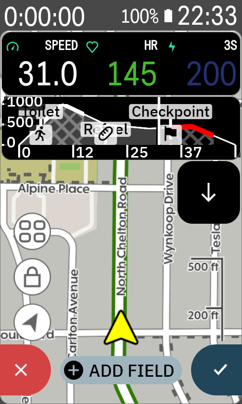
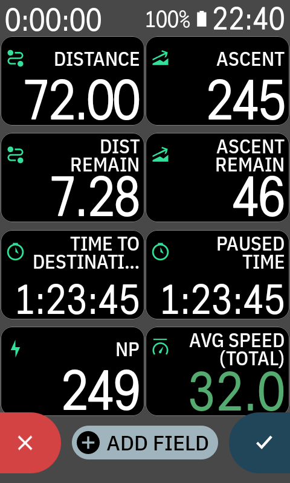
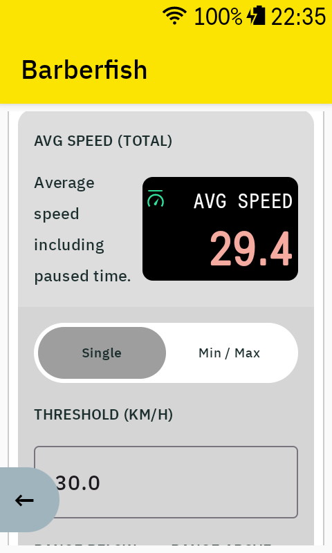

# Barberfish

[Barberfishes](https://en.wikipedia.org/wiki/Johnrandallia) keeps Hammerheads sharp, in the ocean and on your bike.
Native-feeling data field enhancements for the [Hammerhead Karoo](https://www.hammerhead.io/).

 

Barberfish extends the Karoo's built-in data fields. It adds a three-column HUD, configurable zone color palettes and coloring styles, unambiguous time formatting, and average speed fields with threshold coloring, all designed to look and feel like native Karoo fields.

## Data field enhancements

| Feature             | Default Karoo                                                                                                                                                      | Barberfish                                                                  |
| ------------------- | ------------------------------------------------------------------------------------------------------------------------------------------------------------------ | --------------------------------------------------------------------------- |
| 3-column HUD        | Not available                                                                                                                                                      | Speed, HR, and power side by side with zone coloring                        |
| Zone color palettes | Hammerhead only                                                                                                                                                    | Hammerhead, Wahoo, Zwift, and Intervals.icu                                 |
| Zone coloring style | Background fill only                                                                                                                                               | Background fill or text color                                               |
| Average speed       | Exclusive paused time only                                                                                                                                         | Both inclusive and exclusive paused time variants                           |
| Threshold coloring  | Not available                                                                                                                                                      | Configurable single threshold or min/max thresholds on average speed fields |
| Time formatting     | Ambigious `hh:mm` or `mm:ss` depending on duration                                                                                                                 | Unambiguous: `1h 23m 45s`, `1h 23' 45"`, or `01:23:45`                      |
| Duration fields     | [Built-in duration fields](https://support.hammerhead.io/hc/en-us/articles/35533240795419-Data-Fields-Legend)  including total time, riding time, paused time, ... | Reimplemented with Barberfish formatting options                            |

### Zone color palettes

| Palette       | Power zones (Z1 – Z7)           | Heart rate zones (Z1 – Z5)         |
| ------------- | ------------------------------- | ---------------------------------- |
| Karoo         |      |      |
| Intervals.icu |  |  |
| Wahoo         |      |      |
| Zwift         |      |      |

### Time formatting

| Format   | Under an hour | Over an hour |
| -------- | ------------- | ------------ |
| Racing   | `23'45"`      | `1h23'45"`   |
| Clock    | `0:23:45`     | `1:23:45`    |
| Segments | `23m 45s`     | `1h 23m 45s` |

## Data fields

Complete list of data fields provided by Barberfish.

### HUD

- HUD — three-column speed, heart rate, and power with zone coloring

### Power & Heart Rate

- Power (Instant, 3s, 5s, 10s, 30s, 20m, 1h smoothing)
- Heart rate

### Speed

- Speed (Instant, 3s, 5s, 10s smoothing)
- Total average speed (including paused time)
- Moving-time average speed (excluding paused time)
### Time

- Elapsed time
- Moving time
- Paused time

### Navigation

- Time to destination

### Daylight

- Time to sunrise
- Time to sunset
- Time to civil dawn
- Time to civil dusk

## Examples

|                                                                                           |                                                                                                         |               |          |
| ---------------------------------------------------------------------------------------------------------------------------------------- | ------------------------------------------------------------------------------------------------------------------------------------------------------- | ---------------------------------------------------- | --------------------------------------------------------- |
| HUD on a map page with [RouteGraph](https://github.com/timklge/karoo-routegraph) in the second row. HR and power use text zone coloring. | Unambiguous `1:23:45` time formatting on time-to-destination and paused time, alongside the green total average speed exceding the `30 km/h` threshold. | Karoo-style config screen with collapsible sections. | Average speed threshold config with a live field preview. |

## Use cases
### Map page HUD

The three-column HUD is designed as the top row of a map data page providing speed, heart rate, and power at a glance. 

A single row on the map page is quite high, leading to a lot of unused horizontal space. A nice workaround is adding a second row to occupy this excess horizontal space with e.g. [RouteGraph](https://github.com/timklge/karoo-routegraph) for an elevation profile.

### ACP randonneuring (min + max threshold)

[ACP randonneuring](https://www.audax-club-parisien.com/en/welcomepage/) events impose checkpoint cutoff speeds — 15 km/h minimum and 30 km/h maximum. Set Min: 15 and Max: 30 on the average speed field. The field colors green inside the zone, orange when approaching a boundary, and red when outside.

### Race with a goal pace (single threshold)

Racing a gran fondo with a target average? Set a single threshold at your goal pace. The field colors green above it and red below, so you know at a glance whether you're on track.

## Roadmap

Ideas that may or may not be implemented

- Day mode support  
  fields are currently only tested in night mode; day mode rendering needs verification and adjustments
- Configurable HUD fields  
  choose which metrics appear in each column of the three-column HUD instead of the fixed speed / HR / power layout
- Four-column HUD  
  add a fourth column to fit more metrics at a glance
- ETA data field  
   estimated time of arrival at destination, gradient- and paused-time aware for more accurate predictions on hilly routes

## Compatibility

Tested on a Karoo 3 running firmware 1.618.2377.20. Should work on Karoo 2 and other firmware versions, but no guarantees.

## Installation

1. Find the APK link on the [latest release page](https://github.com/jpweytjens/barberfish/releases/latest).
2. Sideload the APK
   * Karoo 3: via the Karoo app following [Hammerhead's sideloading instructions](https://support.hammerhead.io/hc/en-us/articles/31576497036827-Karoo-Extension-Sideloading).
   * Karoo 2: via your computer following [DC Rainmaker's instructions](https://www.dcrainmaker.com/2021/02/how-to-sideload-android-apps-on-your-hammerhead-karoo-1-karoo-2.html)

## Credits

- [karoo-ext](https://github.com/hammerheadnav/karoo-ext) — the official Hammerhead SDK for building Karoo extensions
- [awesome-karoo](https://github.com/timklge/awesome-karoo) — a curated list of Karoo extensions and resources
- [Hammerhead Visual Data Field System](https://www.figma.com/design/Adr23SlulPNE2RBu1VI28C/%3CH%3E-Visual-Data-Field-System?node-id=1-64&p=f) — the Figma design guide used to match the native Karoo look and feel

## Contributing

Bug reports and pull requests are welcome on [GitHub](https://github.com/jpweytjens/barberfish).

### For extension developers

`BarberfishView` and `BarberfishDataType` are a reimplementation of the native Karoo data field that matches the Hammerhead look and feel, with added support for variable font sizes and control over the fill color behind the label and icon.

See [docs/architecture.md](docs/architecture.md) for the component hierarchy, naming conventions, and the rationale behind using `AndroidRemoteViews` for the label and value rendering.

## License

Released under the [Apache License 2.0](LICENSE).
