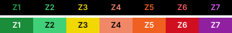
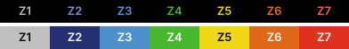
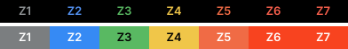
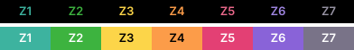
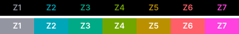

# Barberfish

[Barberfishes](https://en.wikipedia.org/wiki/Johnrandallia) keeps Hammerheads sharp, in [the ocean](https://www.instagram.com/reels/DEGADWAPPEy/) and on your bike.
Native-feeling data field enhancements for the [Hammerhead Karoo](https://www.hammerhead.io/).

 

## What it is

Barberfish replaces a core set of Karoo data fields with reimplementations that match the native look and feel and add features the built-in fields don't offer. A configurable 3- or 4-column HUD groups any combination of speed, heart rate, power, cadence, grade, and other fields side by side with per-slot zone coloring. When a route is loaded, an optional color-coded elevation sparkline below the HUD shows the upcoming terrain. All field settings are configured in the Barberfish app on your Karoo with live-updating previews — changes take effect immediately without restarting your ride.

## What's different

### Algorithms

Grade is smoothed with [ordinary least squares](https://en.wikipedia.org/wiki/Ordinary_least_squares) over a 30 m distance window. The distance-based window keeps the result consistent regardless of speed and avoids smearing the gradient when stopped. ETA is estimated with a [DEWMA](https://github.com/jpweytjens/godot) blend of a 5-minute fast and 1-hour slow component with a configurable speed prior — experimental, see [Godot](https://github.com/jpweytjens/godot) for the ongoing work toward a gradient-aware, forward-looking replacement.

### Zone & grade coloring

Every Barberfish field uses one of three color modes — Text, Fill, or None — configurable per field. Zone palettes: Karoo, Wahoo, Zwift, Intervals.icu, and HSLuv. Grade palettes: Karoo, Wahoo, Garmin, Zwift, HSLuv, and Turbo. Brand-color palettes ship in a contrast-tuned variant that meets [APCA](https://apcacontrast.com/) Lc ≥ 45 for large bold text on the dark Karoo background — used automatically in Text mode. In Fill mode the brand colors are preserved and the overlay text color is auto-picked per cell (black or white, whichever gives higher APCA contrast). HSLuv and Turbo are designed to be readable in both modes without correction.

### Formatting

Time formatting is unambiguous across all durations — three formats to pick from:

| Format   | Under an hour | Over an hour |
| -------- | ------------- | ------------ |
| Racing   | `23'45"`      | `1h23'45"`   |
| Clock    | `0:23:45`     | `1:23:45`    |
| Segments | `23m45s`      | `1h23m45s`   |

Average speed comes in two flavors: including paused time (e.g. for [ACP randonneuring](https://www.audax-club-parisien.com/en/welcomepage/) checkpoint speeds) and excluding paused time. Speed, average speed, and cadence support threshold coloring: speed compares against a fixed target or its running average; average speed and cadence add a min/max range with warning bands.

### Layout

A 3- or 4-column HUD groups any combination of fields side by side with per-slot zone coloring. When a route is loaded, an optional [Tufte](https://www.edwardtufte.com/notebook/sparkline-theory-and-practice-edward-tufte/)-inspired elevation sparkline below the HUD shows recent terrain and the upcoming profile with non-linear zoom around your current position — tap to cycle 5/10/20 km lookahead. For a full 1:1 elevation chart with POIs, see [RouteGraph](https://github.com/timklge/karoo-routegraph). All settings update live with field previews on the config screen; when a route is loaded, the sparkline preview shows your actual route rather than a placeholder.

## Color palettes

Each palette below is shown in both rendering modes. The top row is **Text mode** — palette color drawn as text on the dark Karoo background, using the contrast-tuned variant where one exists. The bottom row is **Fill mode** — palette color as cell fill with the auto-picked overlay text color.

### Zone palettes

| Palette       | Preview                                            |
| ------------- | -------------------------------------------------- |
| Karoo         |                |
| Wahoo         |                |
| Zwift         |                |
| Intervals.icu |            |
| HSLuv         |                |

Power-zone variants are shown above. Heart-rate variants and full RGB references live in [docs/color-palettes.md](docs/color-palettes.md).

### Grade palettes

| Palette | Bands (descent → steep)                                                                       | Preview                                |
| ------- | --------------------------------------------------------------------------------------------- | -------------------------------------- |
| Karoo   | [0, 5) · [5, 8) · [8, 13) · [13, 16) · [16, 20) · [20, 24) · [24, ∞)                          |   |
| Wahoo   | [0, 4) · [4, 8) · [8, 12) · [12, 20) · [20, ∞)                                                |   |
| Garmin  | [0, 3) · [3, 6) · [6, 9) · [9, 12) · [12, ∞)                                                  |  |
| Zwift   | [0, 3) · [3, 6) · [6, 9) · [9, ∞)                                                             |   |
| HSLuv   | [0, 3) · [3, 6) · [6, 9) · [9, 12) · [12, 15) · [15, 18) · [18, ∞)                            |   |
| Turbo   | (-∞, -9) · [-9, -6) · [-6, -3) · [-3, 0) · [0, 3) · [3, 6) · [6, 9) · [9, 12) · [12, 15) · [15, ∞) |   |

## Data fields

Complete list of data fields provided by Barberfish, grouped by category.

### HUD

- HUD (3 or 4 columns with optional elevation sparkline)

### Power

| Field              | Smoothing                                | Zone color           |
|--------------------|------------------------------------------|----------------------|
| Power              | Instant / 3s / 5s / 10s / 30s / 20m / 1h | ✓                    |
| Avg Power          | —                                        | ✓                    |
| Lap Avg Power      | —                                        | ✓                    |
| Last Lap Avg Power | —                                        | ✓                    |
| NP                 | —                                        | ✓                    |
| Power Zone         | —                                        | ✓ (int/float toggle) |
| Max Power          | —                                        | ✓                    |

### Heart Rate

| Field           | Zone color           |
|-----------------|----------------------|
| HR              | ✓                    |
| Avg HR          | ✓                    |
| Lap Avg HR      | ✓                    |
| Last Lap Avg HR | ✓                    |
| %Max HR         | ✓                    |
| Max HR          | ✓                    |
| HR Zone         | ✓ (int/float toggle) |

### Speed

| Field              | Smoothing               | Threshold |
|--------------------|-------------------------|-----------|
| Speed              | Instant / 3s / 5s / 10s | ✓ (Fixed / Avg total / Avg moving) |
| Avg Speed (Total)  | —                       | ✓         |
| Avg Speed (Moving) | —                       | ✓         |

### Cadence

| Field   | Smoothing               | Threshold |
|---------|-------------------------|-----------|
| Cadence | Instant / 3s / 5s / 10s | ✓         |

### Climbing

| Field     | Smoothing      | Zone color (palette) |
|-----------|----------------|----------------------|
| Grade     | OLS (30 m window) | ✓ (grade)            |
| Sparkline | —              | ✓ (grade)            |

### Time

- Elapsed
- Moving
- Paused
- Lap
- Last lap

### Navigation & ETA

- Time to destination
- Remaining ride time
- Time of arrival

### Daylight

- Time to sunrise
- Time to sunset
- Time to civil dawn
- Time to civil dusk

## Examples

|                                                      |                                                                                                           |
| ---------------------------------------------------- | --------------------------------------------------------------------------------------------------------- |
|        | 3-column HUD with elevation sparkline on the map page.                                                    |
|       | 4-column HUD with Wahoo background-fill zone coloring and a grade field.                                  |
|  | Side-by-side: native Karoo fields (left) vs Barberfish (right) for avg HR, HR, 3s power, and paused time. |
|               | Karoo-style config screen with collapsible sections.                                                      |
|     | Threshold configuration of average speed data field with live preview.                                    |
|     | HUD configuration with live-updating fields, elevation sparkline, and slot picker.                        |

## Use cases
### Map page HUD

The HUD is designed as the single top row of a map data page providing 3 or 4 data fields at a glance. When a route is loaded, a sparkline shows the upcoming elevation profile.

### Race with a goal pace (single threshold)

Racing an event with a target average? Set a single threshold at your goal pace on the average speed field (excluding paused time). The field colors green above it and red below, so you know at a glance whether you're on track.

### ACP randonneuring (min / max threshold)

[ACP randonneuring](https://www.audax-club-parisien.com/en/welcomepage/) events impose checkpoint cutoff speeds on your total average speed, including any paused time. The rules set a 15 km/h minimum and 30 km/h maximum. Set Min: 15 and Max: 30 on the total average speed field to keep track. The field colors green inside the zone, orange when approaching a boundary, and red when outside.

## Roadmap

- Gradient-aware forward-looking ETA replacing the current DEWMA estimator with terrain-aware arrival predictions. See [Godot](https://github.com/jpweytjens/godot).
- Workout target field — continuous deviation from the workout target (power, HR, pace) rather than the native discrete below/on target/above states; zone coloring reflects how far off target you are, not just which side you're on

## Compatibility

| Device  | Firmware      |
| ------- | ------------- |
| Karoo 3 | 1.618.2377.20 |
| Karoo 2 | 1.613.2351.12 |

## Installation

1. Find the APK link on the [latest release page](https://github.com/jpweytjens/barberfish/releases/latest).
2. Sideload the APK
   * Karoo 3: via the Karoo app following [Hammerhead's sideloading instructions](https://support.hammerhead.io/hc/en-us/articles/31576497036827-Karoo-Extension-Sideloading).
   * Karoo 2: via your computer following [DC Rainmaker's instructions](https://www.dcrainmaker.com/2021/02/how-to-sideload-android-apps-on-your-hammerhead-karoo-1-karoo-2.html)

## Credits

- [karoo-ext](https://github.com/hammerheadnav/karoo-ext) — the official Hammerhead SDK for building Karoo extensions
- [awesome-karoo](https://github.com/timklge/awesome-karoo) — a curated list of Karoo extensions and resources
- [Hammerhead Visual Data Field System](https://www.figma.com/design/Adr23SlulPNE2RBu1VI28C/%3CH%3E-Visual-Data-Field-System?node-id=1-64&p=f) — the Figma design guide used to match the native Karoo look and feel

## Contributing

Bug reports and pull requests are welcome on [GitHub](https://github.com/jpweytjens/barberfish). Suggestions for new HUD data fields are especially welcomed.

### For extension developers

`BarberfishView` and `BarberfishDataType` are a reimplementation of the native Karoo data field that matches the Hammerhead look and feel, with added support for variable font sizes and control over the fill color behind the label and icon.

See [docs/architecture.md](docs/architecture.md) for the component hierarchy, naming conventions, and the rationale behind using `AndroidRemoteViews` for the label and value rendering. See [docs/sdk-findings.md](docs/sdk-findings.md) for empirically discovered SDK behavior.

## License

Released under the [Apache License 2.0](LICENSE).
