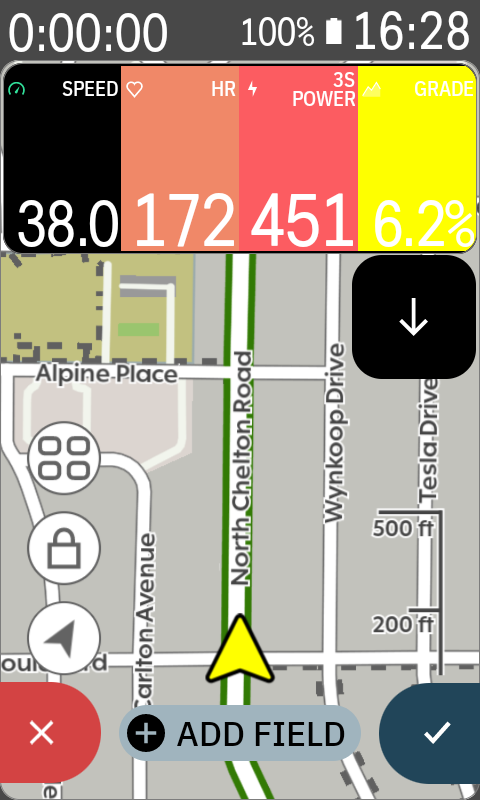
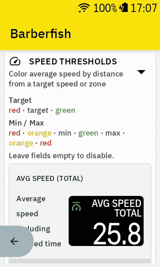
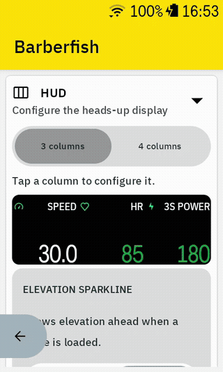

# Barberfish

[Barberfishes](https://en.wikipedia.org/wiki/Johnrandallia) keeps Hammerheads sharp, in [the ocean](https://www.instagram.com/reels/DEGADWAPPEy/) and on your bike.
Native-feeling data field enhancements for the [Hammerhead Karoo](https://www.hammerhead.io/).

 

## Description

Barberfish reimplements and enhances a core set of Karoo data fields with features the built-in fields don't offer. A configurable 3- or 4-column HUD shows any combination of speed, heart rate, power, cadence, average power, normalized power, or grade side by side with zone coloring. An optional color-coded elevation sparkline below the HUD shows the terrain profile when a route is loaded.

Zone coloring supports both background-fill and text-color styles across multiple palettes. Time fields use a consistent, unambiguous format across all durations. Speed, average speed, and cadence fields support threshold coloring: speed compares to a fixed target or its running average, while average speed and cadence add a min/max range with warning bands. All fields are styled to match the native Karoo look and feel. Supports metric and imperial units, dark and light mode. Settings are configured with live-updating field previews.

## Data field enhancements

| Feature             | Default Karoo                                                                                                                                                      | Barberfish                                                                                                                                                   |
| ------------------- | ------------------------------------------------------------------------------------------------------------------------------------------------------------------ | ------------------------------------------------------------------------------------------------------------------------------------------------------------ |
| HUD                 | Not available                                                                                                                                                      | 3- or 4-column layout; each slot selectable from the Barberfish data field collection with per-slot zone coloring                                            |
| Elevation sparkline | Not available                                                                                                                                                      | Color-coded strip below the HUD; only appears when a route is loaded; tap to cycle 5/10/20 km lookahead                                                      |
| Zone color palettes | Karoo only                                                                                                                                                         | Karoo, Wahoo, Zwift, Intervals.icu, and HSLuv                                                                                                                |
| Zone coloring style | Background fill only                                                                                                                                               | Background fill or text color                                                                                                                                |
| Grade coloring      | Not available                                                                                                                                                      | Color-coded by road gradient steepness; Karoo, Wahoo, Garmin, Zwift, HSLuv, and Turbo palettes                                                               |
| Grade smoothing     | Unknown                                                                                                                                                            | [Ordinary least squares](https://en.wikipedia.org/wiki/Ordinary_least_squares) slope over a 30 m distance window to reduce noise from GPS elevation jitter   |
| Average speed       | Exclusive paused time only                                                                                                                                         | Both inclusive and exclusive paused time variants                                                                                                            |
| Speed thresholds    | Not available                                                                                                                                                      | Speed colors against a fixed target or its running average; average speed and cadence add a min/max range with warning bands                                 |
| Time formatting     | Ambigious `hh:mm` or `mm:ss` depending on duration                                                                                                                 | Unambiguous: `1h23m45s`, `1h23'45"`, or `01:23:45`                                                                                                           |
| Duration fields     | [Built-in duration fields](https://support.hammerhead.io/hc/en-us/articles/35533240795419-Data-Fields-Legend)  including total time, riding time, paused time, ... | Reimplemented with Barberfish formatting options                                                                                                             |
| ETA fields          | Time to destination (TTD) and estimated time of arrival (ETA)                                                                                                      | Adds remaining ride time (RRT): predicted cycling time excluding pauses                                                                                      |
| ETA algorithm       | Blends moving-time average speed and a 1-hour rolling average (exact formula unknown)                                                                              | [DEWMA](https://github.com/jpweytjens/godot) blending a 5-min fast and 1-hour slow component with a configurable speed prior (experimental — see note below) |

All field settings are configured in the Barberfish app on your Karoo. Changes update live and take effect immediately without restarting your ride. When a route is loaded, the sparkline preview in the data page configuration shows your actual route rather than a placeholder.

### Color palettes

Every Barberfish field uses one of three color modes — Text, Fill, or None —
configurable per field. Each mode handles contrast on the dark Karoo screen
automatically:

- Text mode draws the palette color as text on the dark datafield background.
  Some brand palette colors (Wahoo navy Z2, Karoo Z6 red, Garmin HC red) are
  hard to read raw. Barberfish ships a contrast-tuned variant of each palette,
  with the [HSLuv](https://www.hsluv.org/) lightness raised until each color
  meets the [APCA](https://apcacontrast.com/) Lc ≥ 45 threshold for large bold
  text.
- Fill mode paints the palette color across the cell and keeps the brand
  colors intact. Text on top is auto-picked per cell (black or white,
  whichever gives higher APCA contrast against that fill), so even dark
  Turbo crimsons and bright Turbo yellows stay legible.

HSLuv is a perceptually uniform palette designed to be readable in both
modes without correction. Turbo is a symmetric scientific colormap that
colors both climbs and descents. See [color palettes](docs/color-palettes.md)
for the full reference.

### Zone color palettes

The Fill mode column shows the brand colors used when a field paints the cell;
the Text mode column shows the contrast-tuned variant used automatically when
the field renders the palette color as text on the dark Karoo background.
HSLuv has a single variant — readable in both modes by construction.

| Palette       | Power Fill mode                 | Power Text mode                          | HR Fill mode                       | HR Text mode                                |
| ------------- | ------------------------------- | ---------------------------------------- | ---------------------------------- | ------------------------------------------- |
| Karoo         |      |      |      |      |
| Wahoo         |      |      |      |      |
| Zwift         |      |      |      |      |
| Intervals.icu |  |  |  |  |
| HSLuv         |      |               |      |               |

### Grade color palettes 

| Palette | Bands (%, flat → steep)                                                                  | Fill mode                          | Text mode                                   |
| ------- | ---------------------------------------------------------------------------------------- | ---------------------------------- | ------------------------------------------- |
| Karoo   | [0, 5) · [5, 8) · [8, 13) · [13, 16) · [16, 20) · [20, 24) · [24, ∞)                     |   |   |
| Wahoo   | [0, 4) · [4, 8) · [8, 12) · [12, 20) · [20, ∞)                                           |   |   |
| Garmin  | [0, 3) · [3, 6) · [6, 9) · [9, 12) · [12, ∞)                                             |  |  |
| Zwift   | [0, 3) · [3, 6) · [6, 9) · [9, ∞)                                                        |   |   |
| HSLuv   | [0, 3) · [3, 6) · [6, 9) · [9, 12) · [12, 15) · [15, 18) · [18, ∞)                       |   |            |
| Turbo   | (-∞, -9) · [-9, -6) · [-6, -3) · [-3, 0) · [0, 3) · [3, 6) · [6, 9) · [9, 12) · [12, 15) · [15, ∞) |   |            |

### Elevation sparkline

A [Tufte](https://www.edwardtufte.com/notebook/sparkline-theory-and-practice-edward-tufte/)-inspired strip showing recent terrain, the immediate climb, and upcoming profile with non-linear zoom around your current position. Tap to cycle between 5, 10, and 20 km lookahead. For a full, 1:1 elevation chart with POIs, see [RouteGraph](https://github.com/timklge/karoo-routegraph).

### Smoothing

Grade smoothing fits an [ordinary least squares](https://en.wikipedia.org/wiki/Ordinary_least_squares) line through the elevation samples over the most recent 30 m of travel and uses its slope as the gradient. The distance-based window keeps the result consistent regardless of speed and avoids smearing the gradient when stopped. ETA estimation uses [DEWMA](https://github.com/jpweytjens/godot), which combines a fast and slow component to account for both short-term changes like the current gradient and longer-term trends like general fatigue. 

DEWMA is a proof of concept rather than a production-ready alternative to the native Karoo ETA. See [Godot](https://github.com/jpweytjens/godot) for the ongoing work toward a gradient-aware, forward-looking ETA that addresses these limitations.

### Time formatting

| Format   | Under an hour | Over an hour |
| -------- | ------------- | ------------ |
| Racing   | `23'45"`      | `1h23'45"`   |
| Clock    | `0:23:45`     | `1:23:45`    |
| Segments | `23m45s`      | `1h23m45s`   |

## Data fields

Complete list of data fields provided by Barberfish, grouped by category.

### HUD

- HUD (3 or 4 columns with optional elevation sparkline)

### Power

| Field              | Smoothing                                | Zone color           |
|--------------------|------------------------------------------|----------------------|
| Power              | Instant / 3s / 5s / 10s / 30s / 20m / 1h | ✓                    |
| Avg Power          | —                                        | ✓                    |
| Lap Avg Power      | —                                        | ✓                    |
| Last Lap Avg Power | —                                        | ✓                    |
| NP                 | —                                        | ✓                    |
| Power Zone         | —                                        | ✓ (int/float toggle) |
| Max Power          | —                                        | ✓                    |

### Heart Rate

| Field           | Zone color           |
|-----------------|----------------------|
| HR              | ✓                    |
| Avg HR          | ✓                    |
| Lap Avg HR      | ✓                    |
| Last Lap Avg HR | ✓                    |
| %Max HR         | ✓                    |
| Max HR          | ✓                    |
| HR Zone         | ✓ (int/float toggle) |

### Speed

| Field              | Smoothing               | Threshold |
|--------------------|-------------------------|-----------|
| Speed              | Instant / 3s / 5s / 10s | ✓ (Fixed / Avg total / Avg moving) |
| Avg Speed (Total)  | —                       | ✓         |
| Avg Speed (Moving) | —                       | ✓         |

### Cadence

| Field   | Smoothing               | Threshold |
|---------|-------------------------|-----------|
| Cadence | Instant / 3s / 5s / 10s | ✓         |

### Climbing

| Field     | Smoothing      | Zone color (palette) |
|-----------|----------------|----------------------|
| Grade     | OLS (30 m window) | ✓ (grade)            |
| Sparkline | —              | ✓ (grade)            |

### Time

- Elapsed
- Moving
- Paused
- Lap
- Last lap

### Navigation & ETA

- Time to destination
- Remaining ride time
- Time of arrival

### Daylight

- Time to sunrise
- Time to sunset
- Time to civil dawn
- Time to civil dusk

## Examples

|                                                      |                                                                                                           |
| ---------------------------------------------------- | --------------------------------------------------------------------------------------------------------- |
|        | 3-column HUD with elevation sparkline on the map page.                                                    |
|       | 4-column HUD with Wahoo background-fill zone coloring and a grade field.                                  |
|  | Side-by-side: native Karoo fields (left) vs Barberfish (right) for avg HR, HR, 3s power, and paused time. |
|               | Karoo-style config screen with collapsible sections.                                                      |
|     | Threshold configuration of average speed data field with live preview.                                    |
|     | HUD configuration with live-updating fields, elevation sparkline, and slot picker.                        |

## Use cases
### Map page HUD

The HUD is designed as the single top row of a map data page providing 3 or 4 data fields at a glance. When a route is loaded, a sparkline shows the upcoming elevation profile.

### Race with a goal pace (single threshold)

Racing an event with a target average? Set a single threshold at your goal pace on the average speed field (excluding paused time). The field colors green above it and red below, so you know at a glance whether you're on track.

### ACP randonneuring (min / max threshold)

[ACP randonneuring](https://www.audax-club-parisien.com/en/welcomepage/) events impose checkpoint cutoff speeds on your total average speed, including any paused time. The rules set a 15 km/h minimum and 30 km/h maximum. Set Min: 15 and Max: 30 on the total average speed field to keep track. The field colors green inside the zone, orange when approaching a boundary, and red when outside.

## Roadmap

- Gradient-aware forward-looking ETA replacing the current DEWMA estimator with terrain-aware arrival predictions. See [Godot](https://github.com/jpweytjens/godot).
- Workout target field — continuous deviation from the workout target (power, HR, pace) rather than the native discrete below/on target/above states; zone coloring reflects how far off target you are, not just which side you're on

## Compatibility

| Device  | Firmware      |
| ------- | ------------- |
| Karoo 3 | 1.618.2377.20 |
| Karoo 2 | 1.613.2351.12 |

## Installation

1. Find the APK link on the [latest release page](https://github.com/jpweytjens/barberfish/releases/latest).
2. Sideload the APK
   * Karoo 3: via the Karoo app following [Hammerhead's sideloading instructions](https://support.hammerhead.io/hc/en-us/articles/31576497036827-Karoo-Extension-Sideloading).
   * Karoo 2: via your computer following [DC Rainmaker's instructions](https://www.dcrainmaker.com/2021/02/how-to-sideload-android-apps-on-your-hammerhead-karoo-1-karoo-2.html)

## Credits

- [karoo-ext](https://github.com/hammerheadnav/karoo-ext) — the official Hammerhead SDK for building Karoo extensions
- [awesome-karoo](https://github.com/timklge/awesome-karoo) — a curated list of Karoo extensions and resources
- [Hammerhead Visual Data Field System](https://www.figma.com/design/Adr23SlulPNE2RBu1VI28C/%3CH%3E-Visual-Data-Field-System?node-id=1-64&p=f) — the Figma design guide used to match the native Karoo look and feel

## Contributing

Bug reports and pull requests are welcome on [GitHub](https://github.com/jpweytjens/barberfish). Suggestions for new HUD data fields are especially welcomed.

### For extension developers

`BarberfishView` and `BarberfishDataType` are a reimplementation of the native Karoo data field that matches the Hammerhead look and feel, with added support for variable font sizes and control over the fill color behind the label and icon.

See [docs/architecture.md](docs/architecture.md) for the component hierarchy, naming conventions, and the rationale behind using `AndroidRemoteViews` for the label and value rendering. See [docs/sdk-findings.md](docs/sdk-findings.md) for reverse-engineered and empirically discovered SDK behavior.

## License

Released under the [Apache License 2.0](LICENSE).
