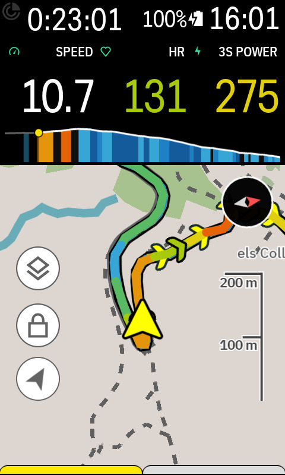
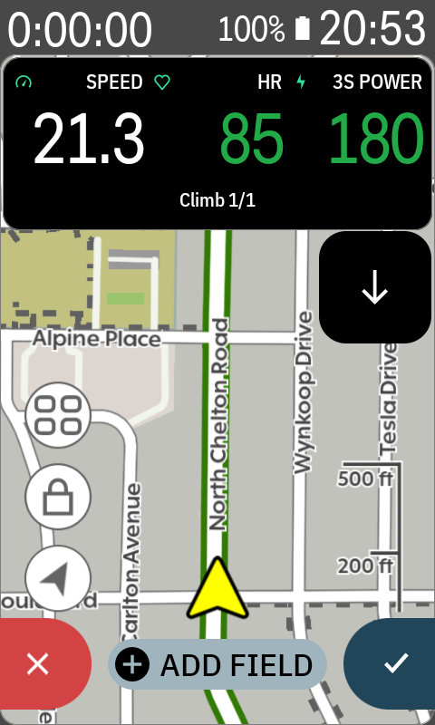
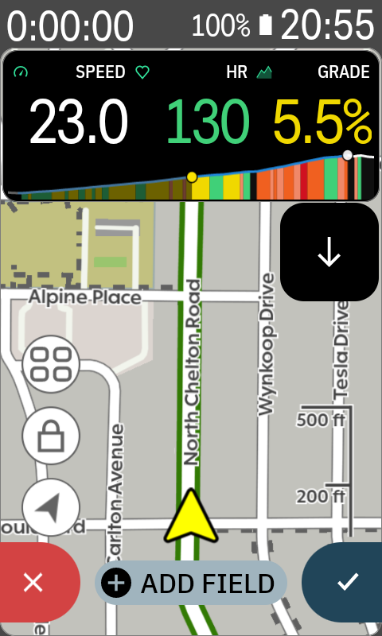
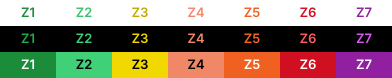

# Barberfish

[Barberfishes](https://en.wikipedia.org/wiki/Johnrandallia) keep Hammerheads sharp, in [the ocean](https://www.instagram.com/reels/DEGADWAPPEy/) and on your bike.
Native-feeling data field enhancements for the [Hammerhead Karoo](https://www.hammerhead.io/).

Barberfish is a collection of data fields for the Hammerhead Karoo. They sit alongside the native ones, match their look, and quietly add a bit more: a 3- or 4-column HUD, an elevation profile drawn as a [Tufte](https://www.edwardtufte.com/notebook/sparkline-theory-and-practice-edward-tufte/)-inspired sparkline, and configurable smoothing, color modes, color palettes, and thresholds per field. Everything is set up in the Barberfish app on your Karoo with live previews; changes apply mid-ride.

<table>
  <tr>
    <td align="center">Elevation profile below a 3-column HUD on the map view</td>
    <td align="center">Karoo native fields beside their Barberfish counterparts</td>
  </tr>
  <tr>
    <td align="center"></td>
    <td align="center"></td>
  </tr>
</table>

## Highlights

- A 3- or 4-column HUD groups any fields side by side, with zone coloring, smoothing, and formatting set per slot.
- With a route loaded, the elevation profile below the HUD shows the terrain ahead or, in Climbs mode, [frames each climb foot to summit](docs/gallery.md#climbs-mode).
- Grade is [smoothed over the last 30 m of road](docs/algorithms.md#grade) rather than a time window, so it holds steady at any speed and stops moving when you do.
- ETA [learns from how you have actually been riding](docs/algorithms.md#eta), so the estimate sharpens as the ride goes on instead of starting from a generic guess.
- Zone and grade coloring as colored text or a filled cell, with [brand palettes kept legible](docs/color-palettes.md) in light and dark mode.
- Threshold coloring for speed, average speed, and cadence, against a fixed target, a min/max range, or your own running average.
- Per-field setup in the Barberfish app with live previews, covering [every field and its options](docs/data-fields.md).

## Gallery

<table>
  <tr>
    <td align="center">Climbs mode flags the next climb before it arrives</td>
    <td align="center">Climbs mode frames the climb foot to summit</td>
  </tr>
  <tr>
    <td align="center"></td>
    <td align="center"></td>
  </tr>
</table>

The [gallery](docs/gallery.md) continues with light mode, threshold coloring, the grey stale grade state, and the config screens.

## Data fields

39 fields across ten categories: power, heart rate, speed, cadence, climbing, navigation, time, ETA, daylight, and the HUD. The [data fields](docs/data-fields.md) page lists each field's palette, threshold, format, and smoothing options.

## Color palettes

Zone palettes from Karoo, Wahoo, Zwift, Intervals.icu, and HSLuv; grade palettes swap in Garmin and Turbo. Each is kept legible in light and dark mode. The [palette set](docs/color-palettes.md) shows every palette in both modes, with the contrast tuning behind them.

## Compatibility

Tested back to firmware 1.618.2377.20 on Karoo 3 and 1.613.2351.12 on Karoo 2. Newer firmware is expected to keep working unless Hammerhead introduces breaking changes to the extension SDK.

Theme, units, and zones follow your Karoo automatically; Karoo's Data Field Design settings do not. [Match Barberfish to your Karoo](docs/matching-karoo.md) shows how to mirror them.

## Installation

1. On your phone, download the latest [barberfish.apk](https://github.com/jpweytjens/barberfish/releases/latest/download/barberfish.apk).
2. Sideload it:
   * Karoo 3: share the downloaded APK to the Hammerhead companion app, following [Hammerhead's sideloading instructions](https://support.hammerhead.io/hc/en-us/articles/31576497036827-Karoo-Extension-Sideloading).
   * Karoo 2: install from a computer following [DC Rainmaker's instructions](https://www.dcrainmaker.com/2021/02/how-to-sideload-android-apps-on-your-hammerhead-karoo-1-karoo-2.html).

## Roadmap

- Gradient-aware forward-looking ETA: see [Godot](https://github.com/jpweytjens/godot)
- Workout target field: continuous deviation from the target (power, HR, pace) with zone coloring reflecting how far off target you are

## Credits

- [karoo-ext](https://github.com/hammerheadnav/karoo-ext): the official Hammerhead SDK for building Karoo extensions
- [awesome-karoo](https://github.com/timklge/awesome-karoo): a curated list of Karoo extensions and resources
- [Hammerhead Visual Data Field System](https://www.figma.com/design/Adr23SlulPNE2RBu1VI28C/%3CH%3E-Visual-Data-Field-System?node-id=1-64&p=f): the Figma design guide used to match the native Karoo look and feel
- [Edward Tufte](https://www.edwardtufte.com/): the sparkline behind the elevation profile
- [Diátaxis](https://diataxis.fr/): the structure behind the documentation
- The Karoo community on [Reddit](https://www.reddit.com/r/Karoo/) and the [Hammerhead forums](https://support.hammerhead.io/hc/en-us/community/topics): feedback and suggestions

## Contributing

Bug reports and pull requests are welcome on [GitHub](https://github.com/jpweytjens/barberfish), especially suggestions for new HUD data fields.

### For extension developers

[`BarberfishView`](app/src/main/kotlin/com/jpweytjens/barberfish/datatype/BarberfishView.kt) and [`BarberfishDataType`](app/src/main/kotlin/com/jpweytjens/barberfish/datatype/BarberfishDataType.kt) reimplement the native Karoo data field look and feel, with variable font sizes and control over the fill color behind the label and icon. The [developer docs](docs/README.md#for-developers) cover the architecture, the SDK findings, and the Karoo 2 quirks.

## License

Released under the [Apache License 2.0](LICENSE).
