# Barberfish

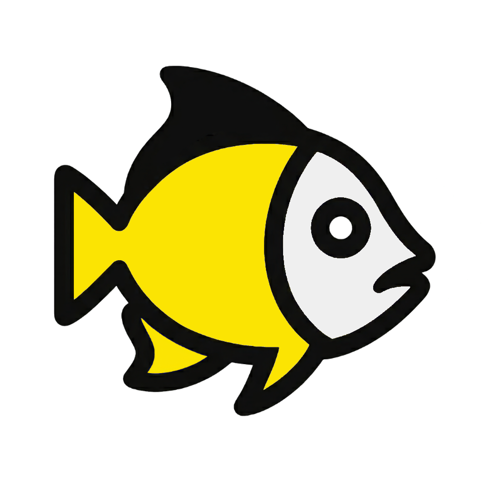

[Barberfishes](https://en.wikipedia.org/wiki/Johnrandallia) keep Hammerheads sharp, in [the ocean](https://www.instagram.com/reels/DEGADWAPPEy/) and on your bike.
Native-feeling data field enhancements for the [Hammerhead Karoo](https://www.hammerhead.io/).

Barberfish is a collection of data fields for the Hammerhead Karoo. They sit alongside the native ones, match their look, and quietly add a bit more: a 3- or 4-column HUD, a [Tufte](https://www.edwardtufte.com/notebook/sparkline-theory-and-practice-edward-tufte/)-inspired elevation sparkline, and configurable smoothing, color modes, color palettes, and thresholds per field. Everything is set up in the Barberfish app on your Karoo with live previews; changes apply mid-ride.

<table>
  <tr>
    <td align="center">Elevation sparkline below a 3-column HUD on the map view</td>
    <td align="center">Karoo native fields beside their Barberfish counterparts</td>
  </tr>
  <tr>
    <td align="center">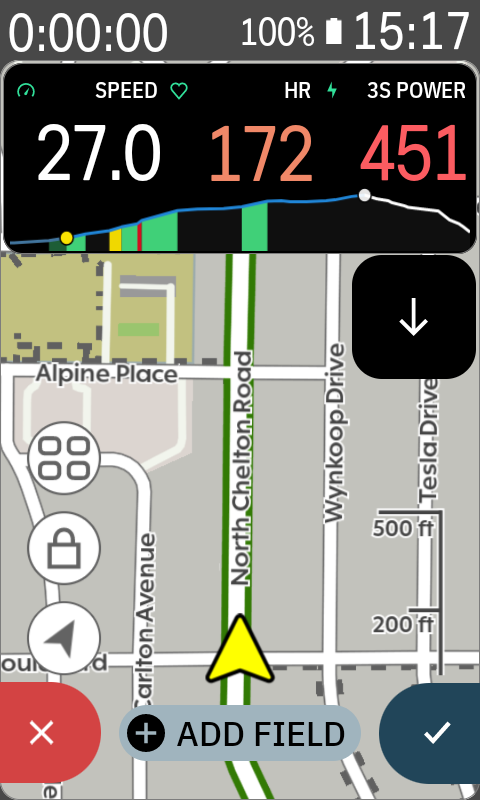</td>
    <td align="center">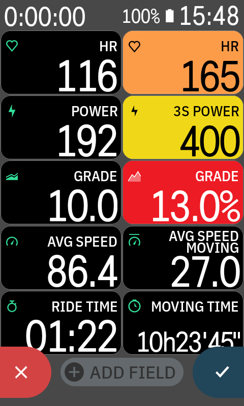</td>
  </tr>
</table>

## Enhancements

### Algorithms

Most GPS bike computer manufacturers, Hammerhead included, don't publish the algorithms behind their built-in smoothing and ETA fields. Barberfish uses explicit, documented ones so the field's behaviour is something you can predict.

Grade is smoothed over distance rather than time, fitting an [ordinary least squares](https://en.wikipedia.org/wiki/Ordinary_least_squares) line through the last 30 m of elevation. A fixed-window time average has to pick between jittering with every cadence stroke (short window) and smearing the start and end of a climb (long window). The OLS-over-distance variant sidesteps the trade by following the road instead of the clock: it holds steady at any speed and stops moving when you do.

ETA blends a 5-minute fast and 1-hour slow [DEWMA](https://github.com/jpweytjens/godot) of recent speed with a configurable prior, so the estimate sharpens as the ride goes on rather than starting from a generic guess. It is not yet gradient-aware, so the climb you can see coming will still pull the arrival time inward. The forward-looking replacement lives in [Godot](https://github.com/jpweytjens/godot).

### Zone & grade coloring

Most fields have a color mode that controls how the value sits on the background. None is the default and applies no zone coloring. Text colors the value with the zone color. Fill paints the background with the zone color and picks black or white for the value so it stays readable on top.

The Karoo background is white in light mode and black in dark mode. Text mode puts the colored value straight on that background, and palettes designed for one theme can read poorly on the other. Barberfish contrast-tunes each brand palette into a light and a dark variant so the colors stay legible against either background.

The tuning uses [APCA](https://apcacontrast.com/): any color below the threshold for legible large text has its [HSLuv](https://www.hsluv.org/) lightness shifted until it passes, hue and saturation kept intact. Fill mode needs no tuning: the value drawn on top adapts to whichever zone color fills the background. The HSLuv palette is built around perceptually uniform lightness from the start and reads the same on both themes without correction. See [docs/color-palettes.md](docs/color-palettes.md) for the full derivation.

### Formatting

Format options vary by category.

Duration fields (time, ETA, daylight) use one of three formats, all unambiguous at any length:

| Format   | Under an hour | Over an hour |
| -------- | ------------- | ------------ |
| Racing   | `23'45"`      | `1h23'45"`   |
| Clock    | `0:23:45`     | `1:23:45`    |
| Segments | `23m45s`      | `1h23m45s`   |

Power Zone and HR Zone toggle between integer (`3`) and one-decimal float (`3.4`) display per field.

### Thresholds

Speed, average speed, and cadence support threshold coloring. Speed compares against a fixed target or its running average. Average speed and cadence compare against a fixed target or a min/max range with warning bands.

### Average speed

Average speed comes in two variants: Total and Moving. Total includes paused time, useful for ultra-distance events and [ACP randonneuring](https://www.audax-club-parisien.com/en/welcomepage/) checkpoint speeds. Moving excludes paused time.

### Layout

A 3- or 4-column HUD groups any combination of fields side by side with per-slot zone coloring. When a route is loaded, an optional [Tufte](https://www.edwardtufte.com/notebook/sparkline-theory-and-practice-edward-tufte/)-inspired elevation sparkline sits below the HUD in one of two modes. On shows the whole route's upcoming terrain with non-linear zoom around your current position; tap to cycle 5/10/20 km lookahead. Climbs is a Barberfish take on Hammerhead's Climber: it stays hidden until a climb nears, shows a `Climb 2/5` heads-up, then frames the climb foot to summit as you ride up and clears at the top, revealing earlier for harder climbs.

## Examples

<table>
  <tr>
    <td align="center">4-column HUD config with fill-mode zone coloring</td>
    <td align="center">Light mode with zone-colored HUD and field comparison</td>
  </tr>
  <tr>
    <td align="center">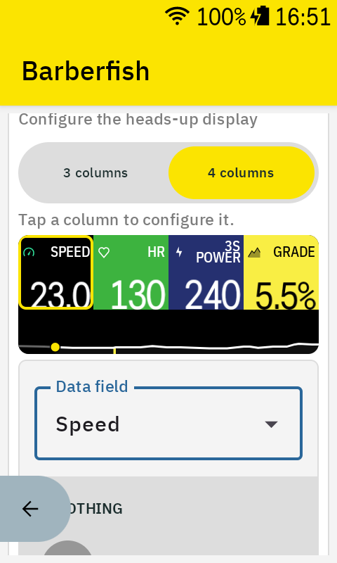</td>
    <td align="center">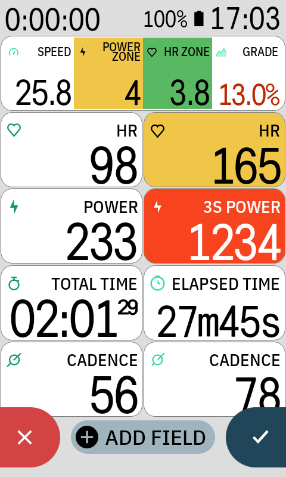</td>
  </tr>
  <tr>
    <td align="center">Climbs mode flags the next climb before it arrives</td>
    <td align="center">Climbs mode frames the climb foot to summit</td>
  </tr>
  <tr>
    <td align="center"></td>
    <td align="center"></td>
  </tr>
  <tr>
    <td align="center">Average speed with target-mode threshold, text coloring above target</td>
    <td align="center">Data field configuration grouped by category</td>
  </tr>
  <tr>
    <td align="center">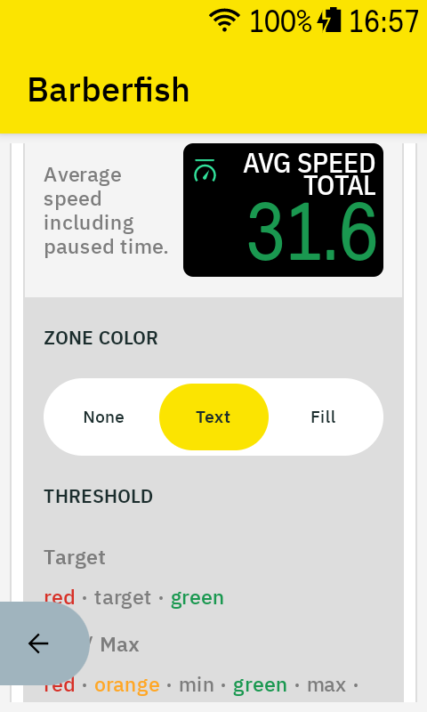</td>
    <td align="center">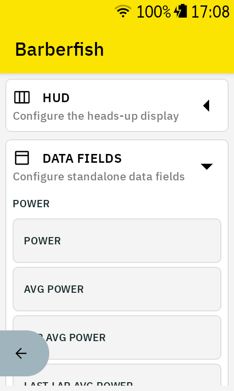</td>
  </tr>
</table>

## Color palettes

Each palette is shown in three rows. The first two are Text mode against the Karoo cell background, once in light mode and once in dark mode, each using its contrast-tuned variant. The third row is Fill mode: palette color as cell fill with the auto-picked overlay text color, which renders the same in either theme.

### Zone palettes

| Palette       | Power zones                               | HR zones                               |
| ------------- | ----------------------------------------- | -------------------------------------- |
| Karoo         | 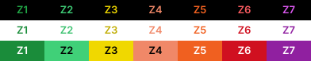     |      |
| Wahoo         | 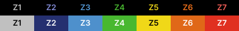     | 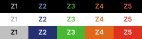     |
| Zwift         | 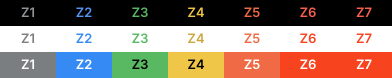     |      |
| Intervals.icu |  | 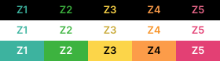 |
| HSLuv         | 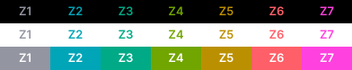     | 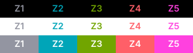     |

### Grade palettes

| Palette | Grade bands                            |
| ------- | -------------------------------------- |
| Karoo   | 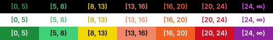  |
| Wahoo   | 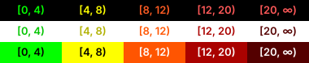  |
| Garmin  | 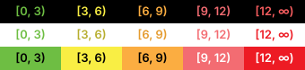 |
| Zwift   | 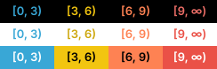  |
| HSLuv   | 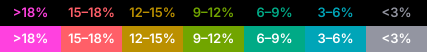  |
| Turbo   | 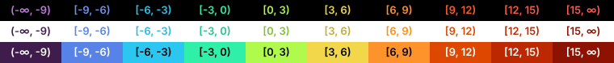  |

For the APCA contrast and HSLuv tuning behind every palette, see [docs/color-palettes.md](docs/color-palettes.md).

## Data fields

Complete list of data fields provided by Barberfish, grouped by category.

<table>
  <thead>
    <tr>
      <th rowspan="2" align="left">Data field</th>
      <th colspan="4" align="center">Enhancements</th>
    </tr>
    <tr>
      <th align="left">Palette</th>
      <th align="left">Threshold</th>
      <th align="left">Format</th>
      <th align="left">Smoothing</th>
    </tr>
  </thead>
  <tbody>
    <tr><th colspan="5" align="center">HUD</th></tr>
    <tr><td>HUD</td><td>per-slot</td><td>per-slot</td><td>per-slot</td><td>per-slot</td></tr>
    <tr><th colspan="5" align="center">Power</th></tr>
    <tr><td>Power</td><td>Zone</td><td></td><td></td><td>Instant / 3s / 5s / 10s / 30s / 20m / 1h</td></tr>
    <tr><td>Avg Power</td><td>Zone</td><td></td><td></td><td></td></tr>
    <tr><td>Lap Avg Power</td><td>Zone</td><td></td><td></td><td></td></tr>
    <tr><td>Last Lap Avg Power</td><td>Zone</td><td></td><td></td><td></td></tr>
    <tr><td>NP</td><td>Zone</td><td></td><td></td><td></td></tr>
    <tr><td>Power Zone</td><td>Zone</td><td></td><td>int / float</td><td></td></tr>
    <tr><td>Max Power</td><td>Zone</td><td></td><td></td><td></td></tr>
    <tr><th colspan="5" align="center">Heart Rate</th></tr>
    <tr><td>HR</td><td>Zone</td><td></td><td></td><td></td></tr>
    <tr><td>Avg HR</td><td>Zone</td><td></td><td></td><td></td></tr>
    <tr><td>Lap Avg HR</td><td>Zone</td><td></td><td></td><td></td></tr>
    <tr><td>Last Lap Avg HR</td><td>Zone</td><td></td><td></td><td></td></tr>
    <tr><td>%Max HR</td><td>Zone</td><td></td><td></td><td></td></tr>
    <tr><td>Max HR</td><td>Zone</td><td></td><td></td><td></td></tr>
    <tr><td>HR Zone</td><td>Zone</td><td></td><td>int / float</td><td></td></tr>
    <tr><th colspan="5" align="center">Speed</th></tr>
    <tr><td>Speed</td><td></td><td>Fixed / Avg total / Avg moving</td><td></td><td>Instant / 3s / 5s / 10s</td></tr>
    <tr><td>Avg Speed (Total)</td><td></td><td>Fixed / Min-max range</td><td></td><td></td></tr>
    <tr><td>Avg Speed (Moving)</td><td></td><td>Fixed / Min-max range</td><td></td><td></td></tr>
    <tr><th colspan="5" align="center">Cadence</th></tr>
    <tr><td>Cadence</td><td></td><td>Fixed / Min-max range</td><td></td><td>Instant / 3s / 5s / 10s</td></tr>
    <tr><th colspan="5" align="center">Climbing</th></tr>
    <tr><td>Grade</td><td>Grade</td><td></td><td></td><td>OLS (30 m window)</td></tr>
    <tr><td>Elevation sparkline</td><td>Grade</td><td></td><td></td><td></td></tr>
    <tr><th colspan="5" align="center">Navigation</th></tr>
    <tr><td>Distance</td><td></td><td></td><td></td><td></td></tr>
    <tr><td>Distance Remaining</td><td></td><td></td><td></td><td></td></tr>
    <tr><td>Elevation Remaining</td><td></td><td></td><td></td><td></td></tr>
    <tr><td>Descent Remaining</td><td></td><td></td><td></td><td></td></tr>
    <tr><td>Remaining Effort</td><td></td><td></td><td></td><td></td></tr>
    <tr><td>Route Remaining</td><td></td><td></td><td></td><td></td></tr>
    <tr><th colspan="5" align="center">Time</th></tr>
    <tr><td>Elapsed</td><td></td><td></td><td>Racing / Clock / Segments</td><td></td></tr>
    <tr><td>Moving</td><td></td><td></td><td>Racing / Clock / Segments</td><td></td></tr>
    <tr><td>Paused</td><td></td><td></td><td>Racing / Clock / Segments</td><td></td></tr>
    <tr><td>Lap</td><td></td><td></td><td>Racing / Clock / Segments</td><td></td></tr>
    <tr><td>Last Lap</td><td></td><td></td><td>Racing / Clock / Segments</td><td></td></tr>
    <tr><th colspan="5" align="center">ETA</th></tr>
    <tr><td>Time to destination</td><td></td><td></td><td>Racing / Clock / Segments</td><td></td></tr>
    <tr><td>Remaining ride time</td><td></td><td></td><td>Racing / Clock / Segments</td><td></td></tr>
    <tr><td>Time of arrival</td><td></td><td></td><td></td><td></td></tr>
    <tr><th colspan="5" align="center">Daylight</th></tr>
    <tr><td>Time to sunrise</td><td></td><td></td><td>Racing / Clock / Segments</td><td></td></tr>
    <tr><td>Time to sunset</td><td></td><td></td><td>Racing / Clock / Segments</td><td></td></tr>
    <tr><td>Time to civil dawn</td><td></td><td></td><td>Racing / Clock / Segments</td><td></td></tr>
    <tr><td>Time to civil dusk</td><td></td><td></td><td>Racing / Clock / Segments</td><td></td></tr>
  </tbody>
</table>

## Compatibility

| Device  | Oldest tested firmware |
| ------- | ---------------------- |
| Karoo 3 | 1.618.2377.20          |
| Karoo 2 | 1.613.2351.12          |

Barberfish is expected to keep working on newer Karoo firmware unless Hammerhead introduces breaking changes to the extension SDK.

Light mode and dark mode are both supported, as are metric and imperial units.

## Installation

1. Find the APK link on the [latest release page](https://github.com/jpweytjens/barberfish/releases/latest).
2. Sideload the APK
   * Karoo 3: via the Karoo app following [Hammerhead's sideloading instructions](https://support.hammerhead.io/hc/en-us/articles/31576497036827-Karoo-Extension-Sideloading).
   * Karoo 2: via your computer following [DC Rainmaker's instructions](https://www.dcrainmaker.com/2021/02/how-to-sideload-android-apps-on-your-hammerhead-karoo-1-karoo-2.html)

## Roadmap

- Gradient-aware forward-looking ETA: see [Godot](https://github.com/jpweytjens/godot)
- Workout target field: continuous deviation from the target (power, HR, pace) with zone coloring reflecting how far off target you are

## Credits

- [karoo-ext](https://github.com/hammerheadnav/karoo-ext): the official Hammerhead SDK for building Karoo extensions
- [awesome-karoo](https://github.com/timklge/awesome-karoo): a curated list of Karoo extensions and resources
- [Hammerhead Visual Data Field System](https://www.figma.com/design/Adr23SlulPNE2RBu1VI28C/%3CH%3E-Visual-Data-Field-System?node-id=1-64&p=f): the Figma design guide used to match the native Karoo look and feel

## Contributing

Bug reports and pull requests are welcome on [GitHub](https://github.com/jpweytjens/barberfish). Suggestions for new HUD data fields are especially welcomed.

### For extension developers

`BarberfishView` and `BarberfishDataType` are a reimplementation of the native Karoo data field that matches the Hammerhead look and feel, with added support for variable font sizes and control over the fill color behind the label and icon.

See [docs/architecture.md](docs/architecture.md) for the component hierarchy, naming conventions, and the rationale behind using `AndroidRemoteViews` for the label and value rendering. See [docs/sdk-findings.md](docs/sdk-findings.md) for empirically discovered SDK behavior.

## License

Released under the [Apache License 2.0](LICENSE).
