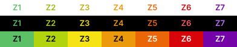
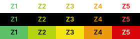
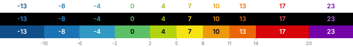

# Color palettes

Every Barberfish field has a color mode (Text, Fill, or None), set per field.
None is the default and applies no coloring. Text colors the value itself
with the zone color. Fill paints the cell background with the zone color and
picks black or white for the value so it stays readable on top. The mode
determines how the chosen palette is rendered, and each mode handles
contrast on both Karoo themes automatically. There is no global readable/original
choice; pick any palette and both modes stay legible.

<table>
  <tr>
    <td align="center">Text mode colors the value</td>
    <td align="center">Fill mode colors the cell</td>
  </tr>
  <tr>
    <td align="center"></td>
    <td align="center"></td>
  </tr>
</table>

The Karoo datafield background is `#000000` in dark mode and `#FFFFFF` in light
mode. All contrast calculations below are run against both, producing a pair of
tuned palettes per brand; Barberfish picks the matching variant from the
current system theme.

Each palette is shown in three rows. The first two are Text mode against the
Karoo cell background, once in light mode and once in dark mode, each using
its contrast-tuned variant. The third row is Fill mode: palette color as cell
fill with the auto-picked overlay text color, which renders the same in
either theme.

## Zone palettes

| Palette       | Power zones                          | HR zones                          |
| ------------- | ------------------------------------ | --------------------------------- |
| Karoo         |      |      |
| Surgeonfish   |  |  |
| Wahoo         |      |      |
| Zwift         |      |      |
| Intervals.icu |  |  |
| HSLuv         |      |      |

The Surgeonfish zone palette is its grade gradient sliced the way Karoo's is:
the flat band is Zone 1 and the six climb bands are Zones 2 to 7, with HR taking
the same five-zone subset. The grade palettes below describe how that gradient is
built.

## Grade palettes

| Palette    | Grade bands                            |
| ---------- | -------------------------------------- |
| Karoo      |   |
| Barberfish |  |
| Surgeonfish |  |
| Turbo      |   |
| Wahoo      |   |
| Garmin     |  |
| HSLuv      |   |
| Zwift      |   |

Barberfish, Surgeonfish, and Turbo color descents; the other palettes stop
at flat. On those a descent takes no color anywhere: the Grade field shows
its value plain, the elevation profile leaves the stretch unfilled, and the
[grade map](grade-map.md#reading-it) draws it in its neutral, the same as
flat road.

## Perceptually uniform palettes

A grade palette is read at a glance, at speed, on a screen the size of a
hand. What matters is that neighbouring bands look different: 8 and 11 per
cent should be told apart by color alone, before the number is read. Palettes
made for a phone or a website do not always manage that on the bike. Several
stack their steepest bands as ever darker reds, and two darks side by side
stop reading as two bands. Perceptual color spaces measure color by how it
looks rather than by how a screen mixes it, so equal steps in grade can be
given equally visible steps in color. Four of the palettes above take that
idea, in four directions.

HSLuv is the strictest of the four, built in the
[HSLuv](https://www.hsluv.org/) color space it is named after, with the
brightness stepping evenly from zone to zone. It runs from a cool grey through
green to reddish pink, and because it was made to read on either theme it is
the one palette that renders the same color in Text and Fill mode, day and
night. The grade variant lays the same colors over seven climb bands from flat
to 18 per cent, spaced like Garmin's grade categories, and leaves descents
uncolored.

Turbo is [Google's rainbow
colormap](https://research.google/blog/turbo-an-improved-rainbow-colormap-for-visualization/),
tuned so that no two steps blur together. Its ten bands run from deep blue at
-9 per cent through green on the flat to red at 15 and beyond, which lands
close to Garmin's grade progression with a descent side added. Barberfish
uses it for grade only.

Barberfish, the default grade palette, brings the same idea to the Karoo's
own colors. The climb ramp above 2 per cent is the Karoo's, so a climb looks
the way the native map has taught you to expect. Below it the Karoo's neutral
band gives way to a quiet sage, which hands over more smoothly to the
descents: three teal-to-slate bands at -2, -6 and -10 per cent, so flat and
downhill read as one limb and only real grades draw the eye. On the [grade
map](grade-map.md#reading-it) that sage is also the color of road too gentle
to mark, so quiet stretches stay part of the palette where most palettes
fall back to a grey. The descent
thresholds mirror the climb side by time rather than by number: in the
[GoldenCheetah OpenData](https://osf.io/6hfpz/) ride corpus, -10 per cent
takes the same share of downhill time as +8 does of uphill, so both sides get
the same resolution.

Surgeonfish takes the same reading with more freedom. Its hazard scale still
climbs from green through yellow, orange and red to a dark purple above 20
per cent, but the steps between are even in HSLuv rather than the Karoo's,
and the flat band is muted so color builds only as the road tilts, and
serves as the grade map's neutral the same way. The
descents keep Barberfish's -2, -6 and -10 and turn blue, deepening toward
navy, after the blue limb of [Peter Kovesi's](https://colorcet.com/)
perceptual rainbow maps. Neither house palette is a true perceptual map; both
borrow perceptual spacing where it sharpens a scale that still reads as
cycling.

## Text mode: auto contrast-tuning

Some brand colors were never meant to be read as text. Wahoo's navy Z2 is
nearly invisible against the dark ride screen, and colors designed for dark
backgrounds (yellows, light greens, pale grays) wash out in light mode.
Barberfish brightens or darkens each affected color just enough to read on
the current theme and keeps the hue, so the palette still looks like the
brand it came from. Colors that already read fine are left alone.

One limitation: two shades that differ only in darkness can end up on the
same adjusted color. The steepest two bands of the Wahoo and Garmin grade
palettes read as one color in Text mode; Fill mode keeps them apart.

For the mechanism: contrast is measured with [APCA](https://apcacontrast.com/)
and [HSLuv](https://www.hsluv.org/) lightness is shifted until the color
passes as large bold text, precomputed per theme by
[`apca_hsluv.py`](../scripts/apca_hsluv.py).

## Fill mode: auto-picked text color

Fill mode keeps every brand color exactly as designed, since the color fills
the cell instead of forming the text. The value drawn on top picks black or
white per cell, whichever reads better against that specific fill: white on
Turbo's deep crimson, black on its lime.

## Threshold colors

Threshold coloring ([Speed, average speed, and cadence](data-fields.md#thresholds))
uses a fixed scale rather than the palettes above, and it is continuous where
zones are stepped. Target mode fades from red below the target through neutral
to green above it; the neutral matches the cell background (black in dark mode,
white in light mode), so an at-target field blends into its neighbors. Range
mode is green inside the range and red outside, with orange warning bands on
both sides of min and max.

| Mode                  | Scale                                        |
| --------------------- | -------------------------------------------- |
| Target (25 km/h)      |     |
| Range (20 to 30 km/h) |      |

The strips show fill mode against the dark theme, with the value text
picked per position as in the palette previews. Text mode draws the scale
as the value color instead, contrast-tuned per theme like the zone palettes
above.
