# Color palettes

Every Barberfish field has a color mode (Text, Fill, or None), set per field.
None is the default and applies no coloring. Text colors the value itself
with the zone color. Fill paints the cell background with the zone color and
picks black or white for the value so it stays readable on top. The mode
determines how the chosen palette is rendered, and each mode handles
contrast on both Karoo themes automatically. There is no global readable/original
choice; pick any palette and both modes stay legible.

<table>
  <tr>
    <td align="center">Text mode colors the value</td>
    <td align="center">Fill mode colors the cell</td>
  </tr>
  <tr>
    <td align="center">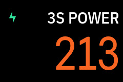</td>
    <td align="center">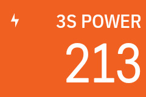</td>
  </tr>
</table>

The Karoo datafield background is `#000000` in dark mode and `#FFFFFF` in light
mode. All contrast calculations below are run against both, producing a pair of
tuned palettes per brand; Barberfish picks the matching variant from the
current system theme.

Each palette is shown in three rows. The first two are Text mode against the
Karoo cell background, once in light mode and once in dark mode, each using
its contrast-tuned variant. The third row is Fill mode: palette color as cell
fill with the auto-picked overlay text color, which renders the same in
either theme.

## Zone palettes

| Palette       | Power zones                          | HR zones                          |
| ------------- | ------------------------------------ | --------------------------------- |
| Karoo         |      | 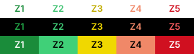     |
| Wahoo         | 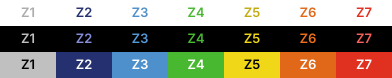     | 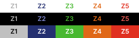     |
| Zwift         | 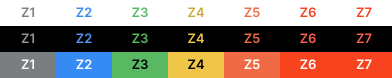     | 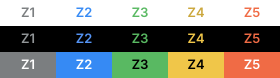     |
| Intervals.icu | 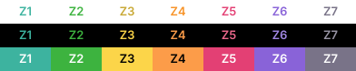 | 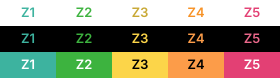 |
| HSLuv         | 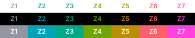     | 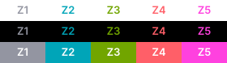     |

## Grade palettes

| Palette | Grade bands                       |
| ------- | --------------------------------- |
| Karoo   | 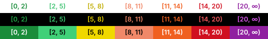  |
| Wahoo   | 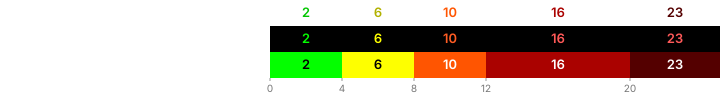  |
| Garmin  |  |
| Zwift   |   |
| HSLuv   | 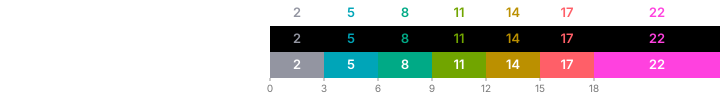  |
| Turbo   | 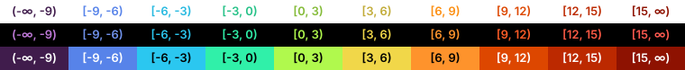  |

## Text mode: auto contrast-tuning

Some brand colors were never meant to be read as text. Wahoo's navy Z2 is
nearly invisible against the dark ride screen, and colors designed for dark
backgrounds (yellows, light greens, pale grays) wash out in light mode.
Barberfish brightens or darkens each affected color just enough to read on
the current theme and keeps the hue, so the palette still looks like the
brand it came from. Colors that already read fine are left alone.

One limitation: two shades that differ only in darkness can end up on the
same adjusted color. The steepest two bands of the Wahoo and Garmin grade
palettes read as one color in Text mode; Fill mode keeps them apart.

For the mechanism: contrast is measured with [APCA](https://apcacontrast.com/)
and [HSLuv](https://www.hsluv.org/) lightness is shifted until the color
passes as large bold text, precomputed per theme by `scripts/apca_hsluv.py`.

## Fill mode: auto-picked text color

Fill mode keeps every brand color exactly as designed, since the color fills
the cell instead of forming the text. The value drawn on top picks black or
white per cell, whichever reads better against that specific fill: white on
Turbo's deep crimson, black on its lime.

The pick lives in `bestTextOnBackground` in
`app/src/main/kotlin/com/jpweytjens/barberfish/datatype/shared/ZoneColoring.kt`.
For a visual sweep of every palette under each text rule, run
`uv run scripts/preview_bg_text_picks.py`; the preview SVGs in the tables
above come from `uv run scripts/generate_palette_previews.py`.

## Threshold colors

Threshold coloring ([Speed, average speed, and cadence](data-fields.md#thresholds))
uses a fixed scale rather than the palettes above, and it is continuous where
zones are stepped. Target mode fades from red below the target through neutral
to green above it; the neutral matches the cell background (black in dark mode,
white in light mode), so an at-target field blends into its neighbors. Range
mode is green inside the range and red outside, with orange warning bands on
both sides of min and max.

| Mode                  | Scale                                        |
| --------------------- | -------------------------------------------- |
| Target (25 km/h)      | 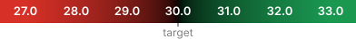    |
| Range (20 to 30 km/h) |      |

The strips show fill mode against the dark theme, with the value text
picked per position as in the palette previews. Text mode draws the scale
as the value color instead, contrast-tuned per theme like the zone palettes
above. The strips are generated by `uv run scripts/generate_threshold_legends.py`.

## HSLuv palette

The [HSLuv](https://www.hsluv.org/) palette is inspired by the perceptually
uniform colormaps available in [seaborn](https://seaborn.pydata.org/tutorial/color_palettes.html).
It was designed from the start with equidistant lightness steps across all
zones such that every color is already readable on both Karoo themes without
modification. The same values render in Text and Fill modes, light and dark.
The hue and saturation were tuned to produce a color progression that
follows the Wahoo palette's character from cool grey to green to redish
pink.

The HSLuv grade palette uses the same colors as the HSLuv power palette,
assigned to grade bands with Garmin-style spacing (seven bands from flat to
steep).

## Turbo palette

The [Turbo](https://research.google/blog/turbo-an-improved-rainbow-colormap-for-visualization/)
palette is Google's perceptually-tuned successor to Jet. It sweeps blue → cyan
→ green → yellow → red with near-uniform perceptual spacing, so every step is
visibly distinct. Unlike the other grade palettes, Turbo covers negative
grades as well as positive ones, a natural fit for grade, which is one of
the few cycling metrics that's genuinely signed. Barberfish uses it for the
grade field only, with ten bands spanning roughly `-9%` (deep blue) through
`0%` (green) to `≥15%` (red).

Turbo's luminance is non-monotonic (the green midband is brighter than
either end), so the APCA + HSLuv pipeline above still applies. The dark
variant (`TURBO_GRADE_BANDS_READABLE_DARK`) raises the dark blues; the light
variant lowers the bright yellows and greens. Fill mode keeps the original
hues and picks black or white text per band.
