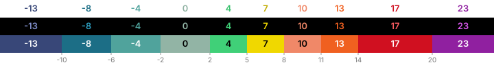

# Color palettes

Every Barberfish field has a color mode (Text, Fill, or None), set per field.
None is the default and applies no coloring. Text colors the value itself
with the zone color. Fill paints the cell background with the zone color and
picks black or white for the value so it stays readable on top. The mode
determines how the chosen palette is rendered, and each mode handles
contrast on both Karoo themes automatically. There is no global readable/original
choice; pick any palette and both modes stay legible.

<table>
  <tr>
    <td align="center">Text mode colors the value</td>
    <td align="center">Fill mode colors the cell</td>
  </tr>
  <tr>
    <td align="center"></td>
    <td align="center"></td>
  </tr>
</table>

The Karoo datafield background is `#000000` in dark mode and `#FFFFFF` in light
mode. All contrast calculations below are run against both, producing a pair of
tuned palettes per brand; Barberfish picks the matching variant from the
current system theme.

Each palette is shown in three rows. The first two are Text mode against the
Karoo cell background, once in light mode and once in dark mode, each using
its contrast-tuned variant. The third row is Fill mode: palette color as cell
fill with the auto-picked overlay text color, which renders the same in
either theme.

## Zone palettes

| Palette       | Power zones                          | HR zones                          |
| ------------- | ------------------------------------ | --------------------------------- |
| Karoo         |      |      |
| Wahoo         |      |      |
| Zwift         |      |      |
| Intervals.icu |  |  |
| HSLuv         |      |      |

## Grade palettes

| Palette    | Grade bands                            |
| ---------- | -------------------------------------- |
| Karoo      |   |
| Barberfish |  |
| Turbo      |   |
| Wahoo      |   |
| Garmin     |  |
| HSLuv      |   |
| Zwift      |   |

Barberfish is the default grade palette. It keeps the Karoo climb ramp above 2
per cent, folds terrain between -2 and 2 into a quiet green-grey, and adds
three teal-to-slate descent bands at -2, -6 and -10. Flat and descent share a
colour family so the whole downhill side reads as one limb, while the flat
band stays muted enough that only real grades draw attention. The descent
thresholds mirror the climb side: measured ride data from the
[GoldenCheetah OpenData](https://osf.io/6hfpz/) corpus shows grade occupancy
puts -10 at the same within-side time share as +8, so descents and climbs
carry matching visual resolution.

## Text mode: auto contrast-tuning

Some brand colors were never meant to be read as text. Wahoo's navy Z2 is
nearly invisible against the dark ride screen, and colors designed for dark
backgrounds (yellows, light greens, pale grays) wash out in light mode.
Barberfish brightens or darkens each affected color just enough to read on
the current theme and keeps the hue, so the palette still looks like the
brand it came from. Colors that already read fine are left alone.

One limitation: two shades that differ only in darkness can end up on the
same adjusted color. The steepest two bands of the Wahoo and Garmin grade
palettes read as one color in Text mode; Fill mode keeps them apart.

For the mechanism: contrast is measured with [APCA](https://apcacontrast.com/)
and [HSLuv](https://www.hsluv.org/) lightness is shifted until the color
passes as large bold text, precomputed per theme by
[`apca_hsluv.py`](../scripts/apca_hsluv.py).

## Fill mode: auto-picked text color

Fill mode keeps every brand color exactly as designed, since the color fills
the cell instead of forming the text. The value drawn on top picks black or
white per cell, whichever reads better against that specific fill: white on
Turbo's deep crimson, black on its lime.

## Threshold colors

Threshold coloring ([Speed, average speed, and cadence](data-fields.md#thresholds))
uses a fixed scale rather than the palettes above, and it is continuous where
zones are stepped. Target mode fades from red below the target through neutral
to green above it; the neutral matches the cell background (black in dark mode,
white in light mode), so an at-target field blends into its neighbors. Range
mode is green inside the range and red outside, with orange warning bands on
both sides of min and max.

| Mode                  | Scale                                        |
| --------------------- | -------------------------------------------- |
| Target (25 km/h)      |     |
| Range (20 to 30 km/h) |      |

The strips show fill mode against the dark theme, with the value text
picked per position as in the palette previews. Text mode draws the scale
as the value color instead, contrast-tuned per theme like the zone palettes
above.

## HSLuv palette

The HSLuv palette is Barberfish's own. Where the brand palettes need
per-theme adjustment, this one was built to read clearly everywhere from the
start: every zone renders the same color in Text and Fill mode, on the light
and dark theme alike, with evenly spaced brightness steps from zone to zone.
The progression follows the Wahoo palette's character, cool grey through
green into reddish pink. It takes its name from
[HSLuv](https://www.hsluv.org/), the color space it was designed in, the
same one the contrast tuning above works in.

The grade variant reuses the power colors across seven bands from flat to
steep, spaced like Garmin's grade categories.

## Turbo palette

Grade is one of the few cycling numbers that goes negative, and Turbo is the
one grade palette that colors descents too. It runs from deep blue around
`-9%` through green at `0%` to red at `15%` and beyond, in ten bands that
each read as their own color. The palette is
[Google's Turbo](https://research.google/blog/turbo-an-improved-rainbow-colormap-for-visualization/),
a rainbow colormap tuned so no two steps blur together. Barberfish uses it
for the grade field only.

Turbo's middle greens are brighter than its blue and red ends, so Text mode
gets the same per-theme tuning as the other palettes: the dark blues are
raised at night, the bright yellows and greens lowered in daylight. Fill
mode keeps the original hues and picks black or white text per band.
