# Color palettes

Every field has a color mode: None, the default, Text, which colors the value, or Fill, which paints the cell and picks black or white for the value on top. Any palette stays legible in both modes on either Karoo theme.

<table>
  <tr>
    <td align="center">Text mode colors the value</td>
    <td align="center">Fill mode colors the cell</td>
  </tr>
  <tr>
    <td align="center">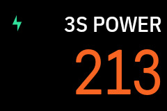</td>
    <td align="center">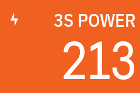</td>
  </tr>
</table>

Each palette below is shown in three rows: Text mode on the light theme, Text mode on the dark theme, each with its colors tuned for that background, and Fill mode, which renders the same in either theme.

## Zone palettes

| Palette       | Power zones                          | HR zones                          |
| ------------- | ------------------------------------ | --------------------------------- |
| Karoo         | 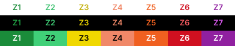     | 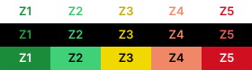     |
| Barberfish    | 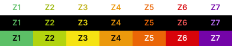 | 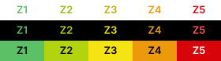 |
| Wahoo         | 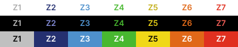     | 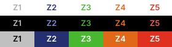     |
| Zwift         | 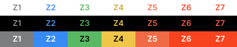     | 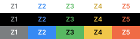     |
| Intervals.icu | 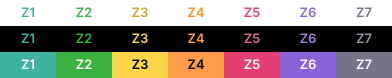 | 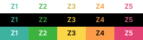 |
| HSLuv         | 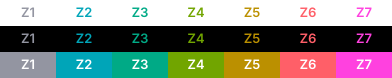     | 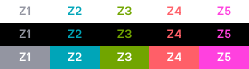     |

The Barberfish zone palette is its grade gradient sliced the way Karoo's is:
the flat band is Zone 1 and the six climb bands are Zones 2 to 7, with HR taking
the same five-zone subset. The grade palettes below describe how that gradient is
built.

## Grade palettes

| Palette    | Grade bands                            | Descents | Flat band  |
| ---------- | -------------------------------------- | -------- | ---------- |
| Karoo      | 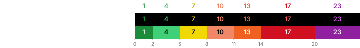  |          | from 0     |
| Barberfish | 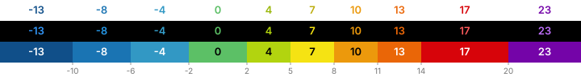 | colored | spans zero |
| Turbo      | 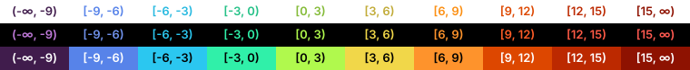  | colored  | from 0     |
| Wahoo      | 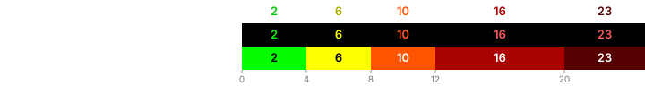  |          | from 0     |
| Garmin     |  |          | from 0     |
| HSLuv      | 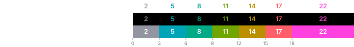  |          | from 0     |
| Zwift      |   |          | from 0     |

Barberfish and Turbo color descents; the other palettes stop
at flat. On those a descent takes no color anywhere: the Grade field shows
its value plain, the elevation profile leaves the stretch unfilled, and the
[grade map](grade-map.md#shared-climbing-settings) draws it in its neutral, the same as
flat road. The two columns also set what [Emphasis](algorithms.md#emphasis)
can reach: a descent handle only where descents are colored, and a stop that
colors the flat band only where it spans zero.

<table>
  <tr>
    <td align="center">Turbo colors the descent past the summit</td>
    <td align="center">Garmin leaves it unfilled</td>
  </tr>
  <tr>
    <td align="center">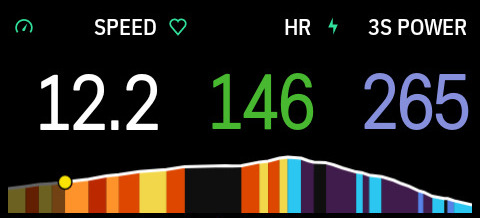</td>
    <td align="center">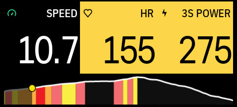</td>
  </tr>
</table>

## Perceptually uniform palettes

A grade palette is read at a glance, at speed, and what matters is that neighbouring bands look different: 8 and 11 per cent told apart by color before the number is read. Palettes made for a phone or a website often stack their steepest bands as ever darker reds, and two darks side by side read as one. Perceptual color spaces measure color by how it looks rather than how a screen mixes it, so equal steps in grade can get equally visible steps in color. Three of the palettes above use that idea.

HSLuv, built in the [HSLuv](https://www.hsluv.org/) space and the strictest of the four, steps its brightness evenly from a cool grey through green to reddish pink over seven climb bands spaced like Garmin's categories, with no descent side. Made to read on either theme, it is the one palette that renders the same in Text and Fill, day and night.

Turbo is [Google's rainbow colormap](https://research.google/blog/turbo-an-improved-rainbow-colormap-for-visualization/), tuned so no two steps blur: ten bands from deep blue at -9 per cent through green on the flat to red at 15 and beyond, close to Garmin's climb progression with a descent side added.

Barberfish, the house palette, runs the hazard scale riders already read, green, yellow, orange and red to a dark purple above 20 per cent, in steps that are even in HSLuv. Its flat band is muted, so color builds only as the road tilts, and its descents turn blue at -2, -6 and -10 per cent, deepening to navy after [Peter Kovesi's](https://colorcet.com/) perceptual rainbows. Those descent thresholds mirror the climb side by time rather than by number: in the [GoldenCheetah OpenData](https://osf.io/6hfpz/) rides, -10 per cent takes the same share of downhill time as +8 does of uphill. It is not a true perceptual map. It borrows perceptual spacing where that sharpens a scale that still reads as cycling.

## Text mode: auto contrast-tuning

Some brand colors were never meant to be read as text: Wahoo's navy Z2 is
nearly invisible on the dark ride screen, and colors made for dark
backgrounds (yellows, light greens, pale grays) wash out in light mode.
Barberfish shifts each affected color's lightness just far enough to pass as
large bold text on the current theme and keeps the hue, so the palette still
looks like the brand it came from. This contrast tuning is done per theme,
with contrast measured by [APCA](https://apcacontrast.com/) and lightness
shifted in [HSLuv](https://www.hsluv.org/).

One limitation: two shades that differ only in darkness can land on the
same adjusted color. The steepest two bands of the Wahoo and Garmin grade
palettes read as one in Text mode; Fill mode keeps them apart.

## Fill mode: auto-picked text color

Fill mode keeps every brand color exactly as designed, since the color fills
the cell instead of forming the text. The value drawn on top picks black or
white per cell, whichever reads better against that specific fill: white on
Turbo's deep crimson, black on its lime.

## Threshold colors

Threshold coloring ([Speed, average speed, and cadence](data-fields.md#thresholds))
uses a fixed scale rather than the palettes above, continuous where zones are
stepped. Target mode fades from red below the target through neutral to green
above it, and the neutral matches the cell background, so an at-target field
blends into its neighbors. Range mode is green inside the range and red
outside, with orange warning bands at both ends. In Text mode the scale colors
the value instead, contrast-tuned per theme like the palettes above.

| Mode                  | Scale                                        |
| --------------------- | -------------------------------------------- |
| Target (30 km/h)      | 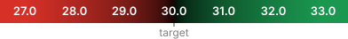    |
| Range (20 to 30 km/h) |      |
