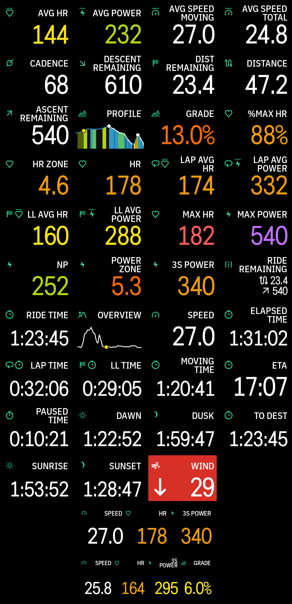
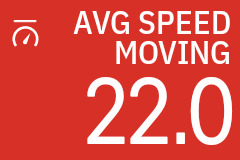
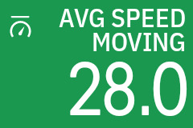
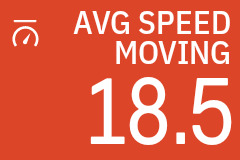
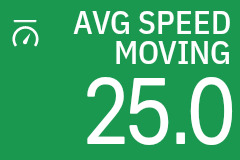
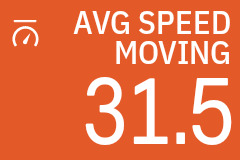

# Data fields

Every data field Barberfish provides, rendered as it appears on the Karoo:
the single-cell fields first, then the 3- and 4-column HUD strips.

The table lists the same fields grouped by category. The Enhancements
columns list the options each field supports. All of them are set per field
in the Barberfish app, with live previews; changes apply mid-ride.

<table>
  <thead>
    <tr>
      <th rowspan="2" align="left">Data field</th>
      <th colspan="4" align="center">Enhancements</th>
    </tr>
    <tr>
      <th align="left">Palette</th>
      <th align="left">Threshold</th>
      <th align="left">Format</th>
      <th align="left">Smoothing</th>
    </tr>
  </thead>
  <tbody>
    <tr><th colspan="5" align="center">HUD</th></tr>
    <tr><td>HUD</td><td>per-slot</td><td>per-slot</td><td>per-slot</td><td>per-slot</td></tr>
    <tr><th colspan="5" align="center">Power</th></tr>
    <tr><td>Power</td><td>Zone</td><td></td><td></td><td>Instant / 3s / 5s / 10s / 30s / 20m / 1h</td></tr>
    <tr><td>Avg Power</td><td>Zone</td><td></td><td></td><td></td></tr>
    <tr><td>NP</td><td>Zone</td><td></td><td></td><td></td></tr>
    <tr><td>Lap Avg Power</td><td>Zone</td><td></td><td></td><td></td></tr>
    <tr><td>Last Lap Avg Power</td><td>Zone</td><td></td><td></td><td></td></tr>
    <tr><td>Power Zone</td><td>Zone</td><td></td><td>int / float</td><td></td></tr>
    <tr><td>Max Power</td><td>Zone</td><td></td><td></td><td></td></tr>
    <tr><th colspan="5" align="center">Heart Rate</th></tr>
    <tr><td>HR</td><td>Zone</td><td></td><td></td><td></td></tr>
    <tr><td>Avg HR</td><td>Zone</td><td></td><td></td><td></td></tr>
    <tr><td>Lap Avg HR</td><td>Zone</td><td></td><td></td><td></td></tr>
    <tr><td>Last Lap Avg HR</td><td>Zone</td><td></td><td></td><td></td></tr>
    <tr><td>%Max HR</td><td>Zone</td><td></td><td></td><td></td></tr>
    <tr><td>Max HR</td><td>Zone</td><td></td><td></td><td></td></tr>
    <tr><td>HR Zone</td><td>Zone</td><td></td><td>int / float</td><td></td></tr>
    <tr><th colspan="5" align="center">Speed</th></tr>
    <tr><td>Speed</td><td></td><td>Fixed / Avg total / Avg moving</td><td></td><td>Instant / 3s / 5s / 10s</td></tr>
    <tr><td>Avg Speed (Total)</td><td></td><td>Fixed / Min-max range</td><td></td><td></td></tr>
    <tr><td>Avg Speed (Moving)</td><td></td><td>Fixed / Min-max range</td><td></td><td></td></tr>
    <tr><th colspan="5" align="center">Cadence</th></tr>
    <tr><td>Cadence</td><td></td><td>Fixed / Min-max range</td><td></td><td>Instant / 3s / 5s / 10s</td></tr>
    <tr><th colspan="5" align="center">Climbing</th></tr>
    <tr><td>Grade</td><td>Grade</td><td></td><td></td><td>OLS (30 m window)</td></tr>
    <tr><td>Profile</td><td>Grade</td><td></td><td></td><td></td></tr>
    <tr><th colspan="5" align="center">Navigation</th></tr>
    <tr><td>Distance</td><td></td><td></td><td></td><td></td></tr>
    <tr><td>Distance Remaining</td><td></td><td></td><td></td><td></td></tr>
    <tr><td>Ascent Remaining</td><td></td><td></td><td></td><td></td></tr>
    <tr><td>Descent Remaining</td><td></td><td></td><td></td><td></td></tr>
    <tr><td>Ride Remaining</td><td></td><td></td><td></td><td></td></tr>
    <tr><td>Overview</td><td></td><td></td><td></td><td></td></tr>
    <tr><th colspan="5" align="center">Time</th></tr>
    <tr><td>Elapsed</td><td></td><td></td><td>Racing / Clock / Segments</td><td></td></tr>
    <tr><td>Moving</td><td></td><td></td><td>Racing / Clock / Segments</td><td></td></tr>
    <tr><td>Paused</td><td></td><td></td><td>Racing / Clock / Segments</td><td></td></tr>
    <tr><td>Lap</td><td></td><td></td><td>Racing / Clock / Segments</td><td></td></tr>
    <tr><td>Last Lap</td><td></td><td></td><td>Racing / Clock / Segments</td><td></td></tr>
    <tr><th colspan="5" align="center">ETA</th></tr>
    <tr><td>Remaining ride time</td><td></td><td></td><td>Racing / Clock / Segments</td><td></td></tr>
    <tr><td>Time to destination</td><td></td><td></td><td>Racing / Clock / Segments</td><td></td></tr>
    <tr><td>Time of arrival</td><td></td><td></td><td></td><td></td></tr>
    <tr><th colspan="5" align="center">Daylight</th></tr>
    <tr><td>Time to sunrise</td><td></td><td></td><td>Racing / Clock / Segments</td><td></td></tr>
    <tr><td>Time to sunset</td><td></td><td></td><td>Racing / Clock / Segments</td><td></td></tr>
    <tr><td>Time to civil dawn</td><td></td><td></td><td>Racing / Clock / Segments</td><td></td></tr>
    <tr><td>Time to civil dusk</td><td></td><td></td><td>Racing / Clock / Segments</td><td></td></tr>
  </tbody>
</table>

## Duration formats

Duration fields (time, ETA, daylight) use one of three formats, all unambiguous at any length:

| Format   | Under an hour | Over an hour |
| -------- | ------------- | ------------ |
| Racing   | `23'45"`      | `1h23'45"`   |
| Clock    | `0:23:45`     | `1:23:45`    |
| Segments | `23m45s`      | `1h23m45s`   |

Power Zone and HR Zone toggle between integer (`3`) and one-decimal float (`3.4`) display per field.

## Thresholds

Speed, average speed, and cadence support threshold coloring. Speed compares against a fixed target or its running average. Average speed and cadence compare against a fixed target or a min/max range with warning bands.

Target mode against a 25 km/h target:

<table>
  <tr>
    <td align="center">Below the target</td>
    <td align="center">Above the target</td>
  </tr>
  <tr>
    <td align="center"></td>
    <td align="center"></td>
  </tr>
</table>

Range mode against a 20 to 30 km/h range:

<table>
  <tr>
    <td align="center">Below the range</td>
    <td align="center">Within the range</td>
    <td align="center">Above the range</td>
  </tr>
  <tr>
    <td align="center"></td>
    <td align="center"></td>
    <td align="center"></td>
  </tr>
</table>

## Average speed variants

Average speed comes in two variants: Total and Moving. Total includes paused time, useful for ultra-distance events and [ACP randonneuring](https://www.audax-club-parisien.com/en/welcomepage/) checkpoint speeds. Moving excludes paused time.
