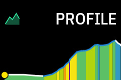
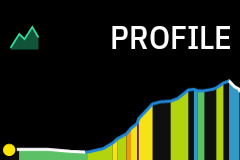
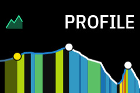
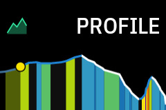
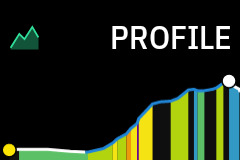
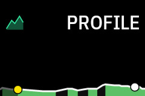
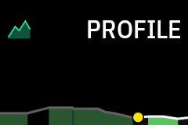
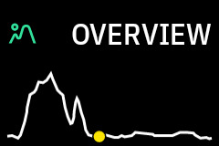

# Elevation profile

A route on the map tells you where to turn, not when to save your legs. The elevation profile answers that second question: a strip of the terrain ahead, colored by grade, with a dot marking where you are. One glance tells you whether the road tips up, how steep, and for how long, early enough to shift, eat, or ease off before the climb instead of on it.

The profile renders in three places, each with its own settings in the Barberfish app:

- The HUD strip, drawn below the 3- or 4-column HUD. Its mode is Off, Climbs, or On: On shows the profile whenever a route is loaded or you are riding to a destination, and Climbs keeps it hidden until a climb nears, then [frames that climb foot to summit](gallery.md#climbs-mode).
- The Profile field, the same lookahead profile as a standalone data field on any page layout.
- The [Overview field](#the-overview-field), the whole route at once.

## Reading it

The fill uses the same [gradient palette](color-palettes.md) as the Grade field, so steepness reads as color before the shape registers. The gentlest grades stay uncolored, which keeps flat roads quiet and makes the climbs stand out; how much stays quiet is the Emphasis setting.

<table>
  <tr>
    <td align="center">Emphasis off colors every gentle rise</td>
    <td align="center">The default one-band skip keeps them quiet</td>
  </tr>
  <tr>
    <td align="center"></td>
    <td align="center"></td>
  </tr>
</table>

Each colored stretch is a simplified segment averaged over its length, so the color reflects the trend of the road rather than the number on the Grade field, and on rolling terrain the two can disagree ([how the coloring works](algorithms.md#grade-coloring)).

Climbs detected by Karoo tint the outline blue, and points of interest on the route appear as markers at their distance down the road.

<table>
  <tr>
    <td align="center">POI markers on</td>
    <td align="center">POI markers off</td>
  </tr>
  <tr>
    <td align="center"></td>
    <td align="center"></td>
  </tr>
</table>

The strip shows a fixed window of road ahead: 5, 10, or 20 km. Tapping the profile cycles through the three, on the HUD strip and the Profile field alike.

## The position dot

For most of a ride the dot sits an eighth of the way in from the left and the road scrolls past it, so a short stretch behind you stays in view and the road in front gets the most pixels, with the terrain ahead compressing gently into the distance. Only the ends differ: the dot starts at the left edge with the whole window ahead and slides to its anchor over the first kilometres, and once less than one window of route remains the window pins to the finish and the dot travels on to the right edge.

<table>
  <tr>
    <td align="center">Route start: everything ahead</td>
    <td align="center">Mid-ride: anchored an eighth in</td>
    <td align="center">Final kilometers: closing out</td>
  </tr>
  <tr>
    <td align="center"></td>
    <td align="center"></td>
    <td align="center"></td>
  </tr>
</table>

The dot is yellow while you are on the route, purple when Karoo is routing you to a destination without a planned route, and red when you are off route.

## Rerouting

Leaving the route turns the dot red. Karoo plots a rejoin path back to your route (the red line on the map) but provides no elevation data for it, so the detour itself cannot be drawn. While the rejoin line is active the profile holds your last on-route position, so the window stays put; once you rejoin, your position is recalculated and the window lands back where you actually are.

## The Overview field

The Overview field draws the entire route as a single outline with the same position dot: no grade coloring, no scrolling window, just where you are between start and finish. It answers a different question than the profile (how far along am I?) and pairs well with it on a long-ride page.

It carries two settings: Simplification, which trims the outline to its broad shape, and the header toggle.

## Shaping the profile

The HUD strip and the Profile field carry the same settings, kept separately per surface, each with a live preview in the Barberfish app.

| Setting | Options | Effect |
| --- | --- | --- |
| Lookahead | 5 / 10 / 20 km | Distance shown ahead of your position. Tapping the profile cycles it. |
| Emphasis | Handles on the palette bar | Grade at which color starts; gentler grades stay unfilled. What a handle can reach depends on the palette ([Emphasis](algorithms.md#emphasis)). |
| Simplification | Off / Mild / Medium / Max | Floor on the smallest bump the profile keeps ([Simplification](algorithms.md#simplification)). |
| X-warp | Off / Mild / Medium / Max | Fisheye magnification around the dot: nearby road gets more pixels, distant road fewer. |
| Y-zoom | Close / Normal / Wide | Zoom on elevation changes. Close amplifies minor bumps, Wide smooths them out. |
| Climbs | On / Off | Blue outline on climbs detected by Karoo. |
| POIs | On / Off | POI markers along the profile. |
| Header | On / Off | Field name and icon above the profile. |

In Climbs mode the window is pinned to the climb rather than your position, so Lookahead and X-warp have no effect there.
