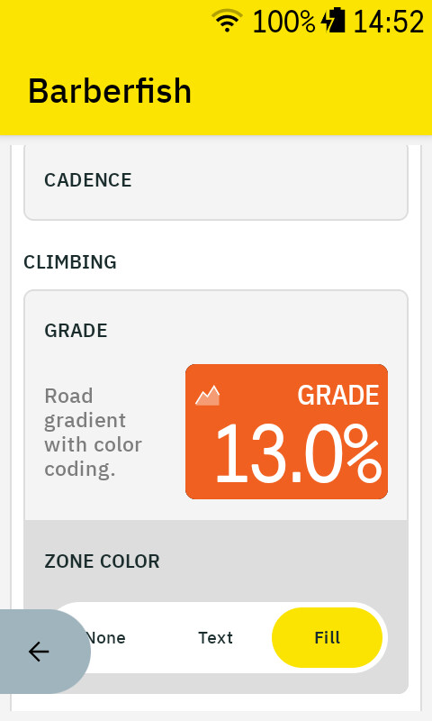
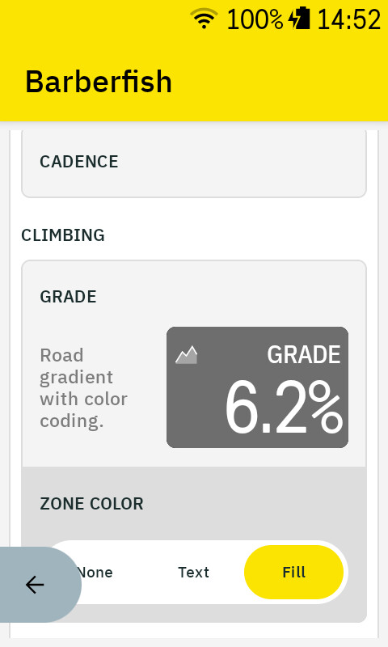

# Gallery

Barberfish on the Karoo, including the states a short ride might not show. Where a screenshot has a deeper story, the line above it links there.

## HUD and elevation profile

Slots, columns, and the profile modes are set per field in the Barberfish app ([every field and its options](data-fields.md)).

<table>
  <tr>
    <td align="center">Elevation profile below a 3-column HUD on the map view</td>
    <td align="center">4-column HUD config with fill-mode zone coloring</td>
  </tr>
  <tr>
    <td align="center"></td>
    <td align="center"></td>
  </tr>
</table>

## Climbs mode

The profile stays hidden until a climb nears, flags it with a heads-up, then frames it foot to summit until it clears at the top.

<table>
  <tr>
    <td align="center">Climbs mode flags the next climb before it arrives</td>
    <td align="center">Climbs mode frames the climb foot to summit</td>
  </tr>
  <tr>
    <td align="center"></td>
    <td align="center"></td>
  </tr>
</table>

## Grade

Grade colors its cell by the gradient palette and greys out when the estimate is not reliable, holding the last reading instead of going blank ([how the estimate works](algorithms.md#grade)).

<table>
  <tr>
    <td align="center">Grade fill colored by the gradient palette</td>
    <td align="center">Grade greys out when the estimate is not reliable</td>
  </tr>
  <tr>
    <td align="center"></td>
    <td align="center"></td>
  </tr>
</table>

## Themes and the native comparison

Light and dark mode are both supported, with each palette tuned per theme ([the full set](color-palettes.md)).

<table>
  <tr>
    <td align="center">Light mode with zone-colored HUD and field comparison</td>
    <td align="center">Karoo native fields beside their Barberfish counterparts</td>
  </tr>
  <tr>
    <td align="center"></td>
    <td align="center"></td>
  </tr>
</table>

## Config screens

Every option lives in the Barberfish app with live previews ([the full option list](data-fields.md)); threshold coloring compares against a target or range ([thresholds](data-fields.md#thresholds)).

<table>
  <tr>
    <td align="center">Data field configuration grouped by category</td>
    <td align="center">Average speed with target-mode threshold, text coloring above target</td>
  </tr>
  <tr>
    <td align="center"></td>
    <td align="center"></td>
  </tr>
</table>
