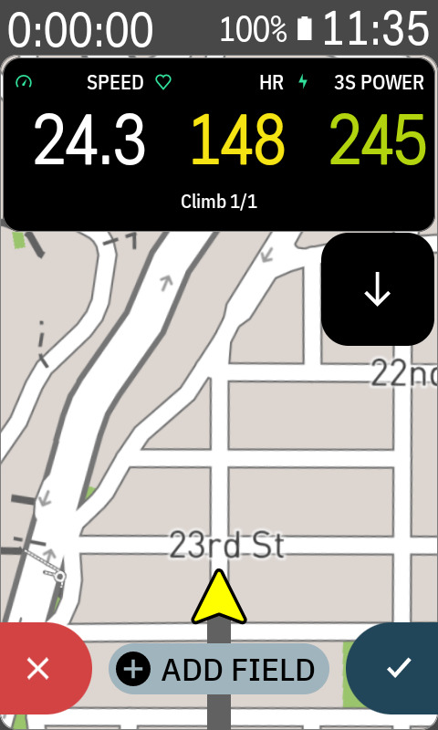
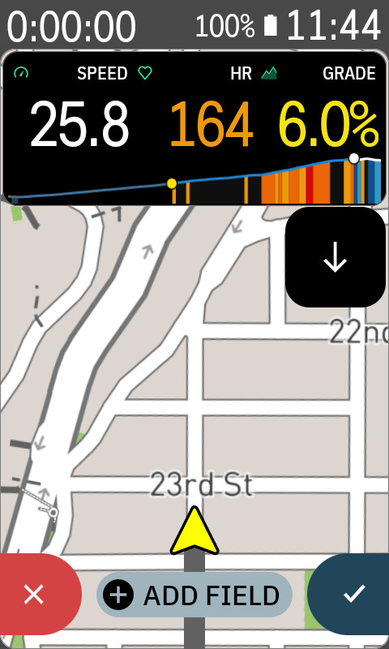
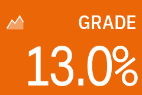
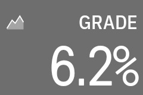
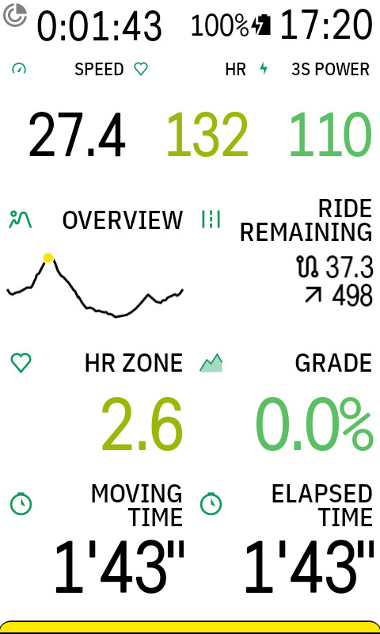
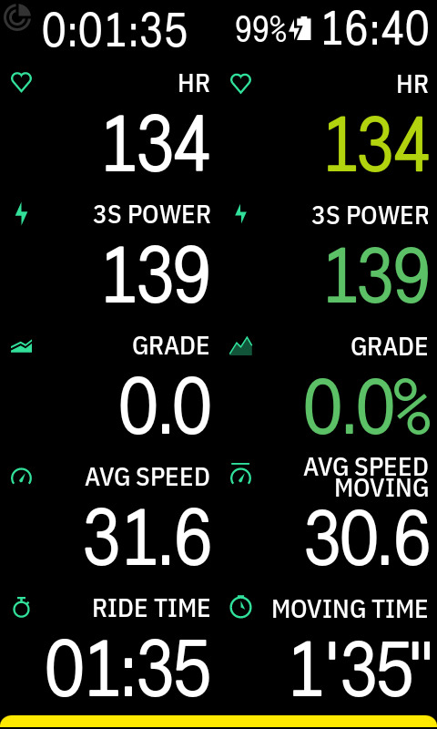
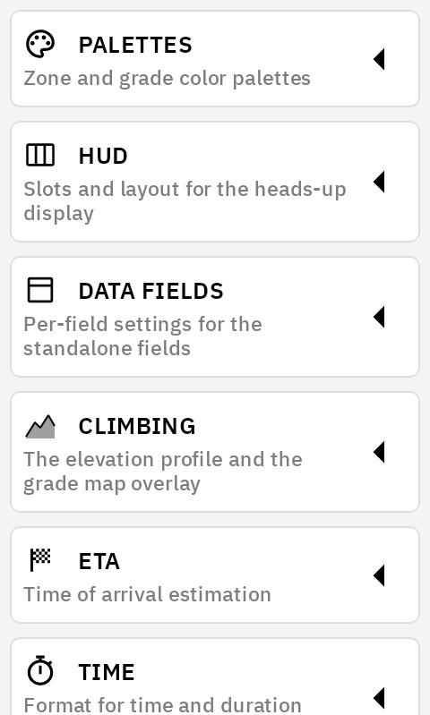
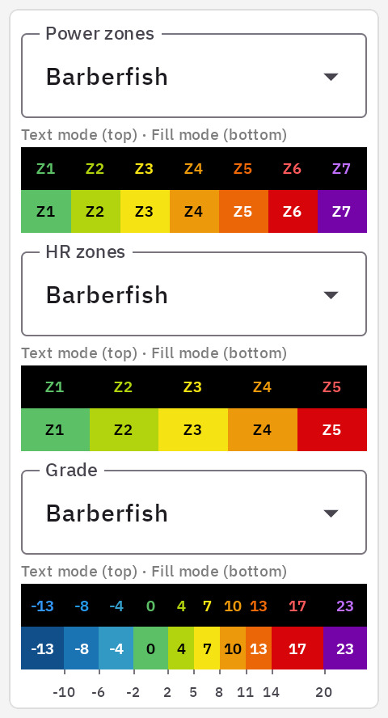
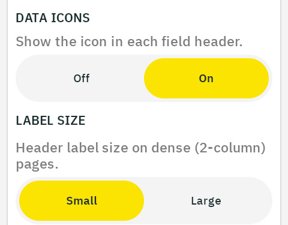
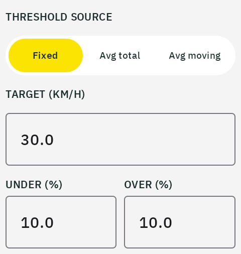

# Gallery

## HUD and elevation profile

The [HUD](hud.md) and the [elevation profile](elevation-profile.md) each have a page of their own.

<table>
  <tr>
    <td align="center">Elevation profile below a 3-column HUD on the map view</td>
    <td align="center">HUD config with the Power column tapped to set its smoothing and zone color</td>
  </tr>
  <tr>
    <td align="center" valign="top"></td>
    <td align="center" valign="top"></td>
  </tr>
</table>

## Climbs mode

The profile stays hidden until a climb nears, flags it with a heads-up counter (`Climb 1/1` below: the first and only climb on that route), then frames it foot to summit until it clears at the top. The overlay appears earlier for harder climbs.

<table>
  <tr>
    <td align="center">Climbs mode flags the next climb before it arrives</td>
    <td align="center">Climbs mode frames the climb foot to summit</td>
  </tr>
  <tr>
    <td align="center"></td>
    <td align="center"></td>
  </tr>
</table>

## Grade

Grade colors its cell by the gradient palette, searches until it has 30 m of road, and greys out when the estimate is not reliable, holding the last reading instead of going blank ([how the estimate works](algorithms.md#grade)).

<table>
  <tr>
    <td align="center">Searching during the first 30 m</td>
    <td align="center">Fill colored by the gradient palette</td>
    <td align="center">Grey hold when you stop</td>
  </tr>
  <tr>
    <td align="center"></td>
    <td align="center"></td>
    <td align="center"></td>
  </tr>
</table>

## Themes and the native comparison

Light and dark mode are both supported, with [each palette tuned per theme](color-palettes.md).

<table>
  <tr>
    <td align="center">Light mode with the HUD and route fields</td>
    <td align="center">Karoo native fields beside their Barberfish counterparts</td>
  </tr>
  <tr>
    <td align="center"></td>
    <td align="center"></td>
  </tr>
</table>

## Config screens

Every option lives in the Barberfish app with live previews, and changes apply mid-ride.

<table>
  <tr>
    <td align="center"><a href="data-fields.md">Data fields</a>, grouped by category</td>
    <td align="center"><a href="color-palettes.md">Palette</a> pickers with live previews</td>
  </tr>
  <tr>
    <td align="center" valign="top"></td>
    <td align="center" valign="top"></td>
  </tr>
  <tr>
    <td align="center"><a href="matching-karoo.md">Data field design</a>, set to match the Karoo's own</td>
    <td align="center"><a href="data-fields.md#thresholds">Threshold</a> controls on the Speed field</td>
  </tr>
  <tr>
    <td align="center" valign="top"></td>
    <td align="center" valign="top"></td>
  </tr>
</table>
