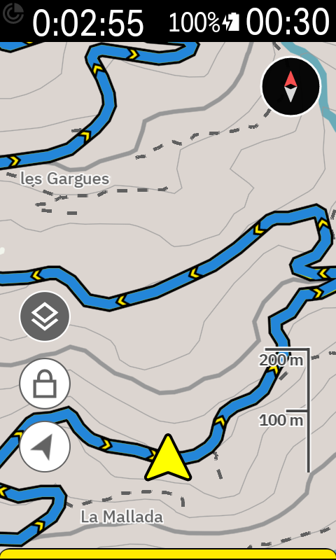
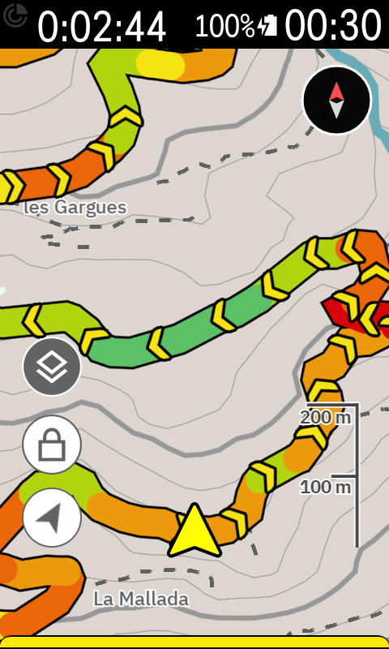
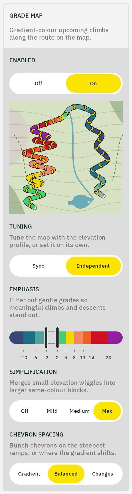

# Grade map

The Karoo's map shows where the route goes. With the grade map on, it also shows how steep: the route is drawn as a band colored by grade, with chevrons on top for direction. A glance at the map tells you whether the next bend hides a climb and how hard it bites, without swiping to the profile page.

<table>
  <tr>
    <td align="center">The Karoo's own route line on the <a href="https://climbfinder.com/en/climbs/coll-de-la-garga-riu-de-xalo">Coll de la Garga</a>, blue for a detected climb</td>
    <td align="center">The same switchbacks with the grade map on</td>
  </tr>
  <tr>
    <td align="center"></td>
    <td align="center"></td>
  </tr>
</table>

The grade map is a single switch under Climbing in the Barberfish app, and it draws whenever you follow a route. The preview on its card shows the band on a sample route.

## Reading it

The band uses the same [gradient palette](color-palettes.md) as the Grade field and the elevation profile, and the same Emphasis and Simplification decide how much of the route takes a color ([how the coloring works](algorithms.md#grade-coloring)), so a color means the same grade on all three. The map follows the Profile field's values so the two agree; set Tuning to Independent to give the map its own.

The band covers the whole route, with any road that takes no color drawn in a neutral rather than left bare, so that any yellow on the map is a grade. The Karoo's own line is yellow, blue only on the climbs it detects (as in the shot above), and nearly every palette has a yellow for a moderate climb; a band that left uncolored road to the Karoo's line would make every yellow stretch ambiguous.

On Barberfish and Surgeonfish the neutral is the palette's own flat color, a sage and a muted green, so quiet road still looks like part of the palette; the other palettes have no flat band to borrow and take a light grey. On a palette that [does not color descents](color-palettes.md#grade-palettes), every descent draws in the neutral as well.

Chevrons show direction, and their spacing points at the road worth noticing. Under Gradient they sit closer together the steeper the road gets, up or down. The band's color already says that, so Changes spends them differently: they bunch where the gradient shifts, at the foot of a climb, a ramp, or a crest, and thin out where it holds steady. Balanced weighs the two equally.

## Behind you, and out and back

Behind you the band stays drawn and only its chevrons clear, so the road already ridden is the stretch without them. On a route that covers the same road twice, an out-and-back or a lap course, the first pass draws on top. Its colors stay while that road is still on screen, then give way to the next pass's before you reach it again. The road ahead is always the one colored: the hill you climbed on the way out shows its descent colors on the way back. Laps in the same direction look identical on every pass.

## Off route

Leave the route and the Karoo plots a path back. The grade map draws that path as a second band in the map's rerouting red, with red chevrons at a steady spacing since there is no grade to vary them with, and clears it once you rejoin.

## How it is drawn

An extension can only draw on top of the Karoo's route line, never beneath it or in its place. The line and its chevrons stay on the map, so the only way to decide what the route looks like is to cover them. That is why the band is broader than the line it stands in for: it is just wide enough to hide both.

The band is also many pieces rather than one line. Each stretch of color is its own segment, with a black casing beneath it that keeps the edge crisp against the map, and the map adds them in its own time. On the first draw, and after a zoom on a long route or one that repeats ground, that takes a second or two, and the Karoo's line may show through until the band settles. Nothing needs restarting.

## Settings

| Setting | Options | Effect |
| --- | --- | --- |
| Enabled | On / Off | Draw the band and chevrons over the route. Off shows the Karoo's own line. |
| Tuning | Sync / Independent | Take Emphasis and Simplification from the Profile field, or set them here. |
| Emphasis | Handles on the palette bar | Grade at which color starts; gentler road draws in the neutral ([Emphasis](algorithms.md#emphasis)). |
| Simplification | Off / Mild / Medium / Max | Floor on the smallest bump the band keeps ([Simplification](algorithms.md#simplification)). |
| Chevron spacing | Gradient / Balanced / Changes | Bunch chevrons on the steepest road, where the gradient shifts, or in between. |
