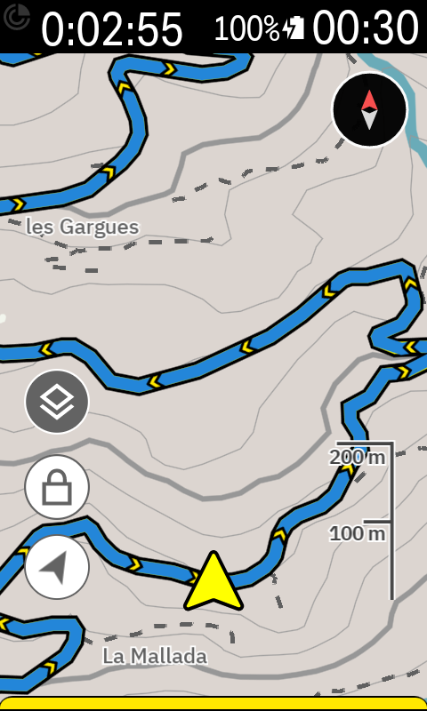
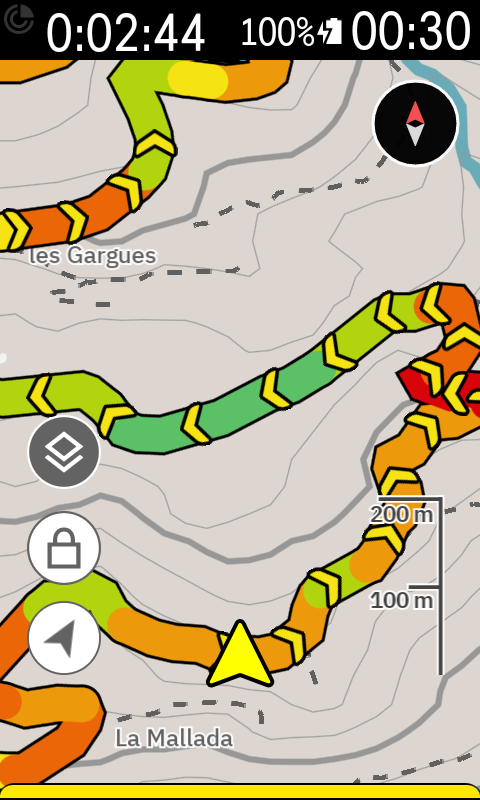

# Grade map

The grade map colors your route on the Karoo's map by grade, as a wide band with chevrons on top for direction. The elevation profile tells you how long a climb lasts; the map tells you where it starts. At a glance you see whether the road kicks up behind the next corner, and whether the hairpin ahead is steep or just a bend.

<table>
  <tr>
    <td align="center">The Karoo's own route line on the <a href="https://climbfinder.com/en/climbs/coll-de-la-garga-riu-de-xalo">Coll de la Garga</a>, blue for a detected climb</td>
    <td align="center">The same switchbacks with the grade map on</td>
  </tr>
  <tr>
    <td align="center"></td>
    <td align="center"></td>
  </tr>
</table>

On the Molenberg below, the band is orange under the rider, yellow just past the crossing and green 200 m on: the steep part is the one under the wheels, and it eases soon.

Turn it on in the Grade Map card under Climbing in the Barberfish app; it draws whenever you follow a route.

The grade map is in beta. Reports of how it draws on your routes are welcome in [GitHub issues](https://github.com/jpweytjens/barberfish/issues).

## Shared climbing settings

The grade map, the Grade field and the elevation profile all draw from one [grade palette](color-palettes.md#grade-palettes), so a color means the same grade on all three. The map also takes its [Emphasis and Simplification](algorithms.md#grade-coloring) from the Profile field, and keeps them in step as you change them there. To tune the map on its own, set its Tuning to Independent.

Road gentler than the Emphasis handles still gets a band, in a neutral: the flat band's muted green on Barberfish, grey on the other palettes. Left to the Karoo's own line it would be ambiguous, since that line is yellow and so is a moderate climb in nearly every palette. On a palette that [does not color descents](color-palettes.md#grade-palettes), descents draw in the neutral too. The [Emphasis examples](algorithms.md#emphasis) show both neutrals on the palette bar.

## The direction you ride

Karoo's Climber marks a detected climb in blue whichever way you ride it. The grade map colors the road for the direction you are about to ride it, and road already ridden keeps its colors but loses its chevrons. On an out-and-back, a climb you descend on the way out shows descent colors; once it drops out of view, it switches to climb colors before you come back to it.

## How it is drawn

An extension can only draw on top of the Karoo's route line, never in its place, so the band is wider than the line to cover it. When you leave the route, the Karoo's path back gets a band too, in the map's rerouting red, and it clears once you rejoin. The map adds the band piece by piece, so when a route starts, and after a zoom on a long one, the Karoo's line can show through for a second or two.

## Settings

| Setting | Options | Effect |
| --- | --- | --- |
| Enabled | On / Off | Draw the band and chevrons over the route. Off shows the Karoo's own line. |
| Tuning | Sync / Independent | Take Emphasis and Simplification from the Profile field, or set them here. |
| Emphasis | Handles on the palette bar | Grade at which color starts; gentler road draws in the neutral ([Emphasis](algorithms.md#emphasis)). |
| Simplification | Off / Mild / Medium / Max | Floor on the smallest bump the band keeps ([Simplification](algorithms.md#simplification)). |
| Chevron spacing | Gradient / Balanced / Changes | Bunch chevrons on the steepest road, where the gradient shifts, or in between. |
