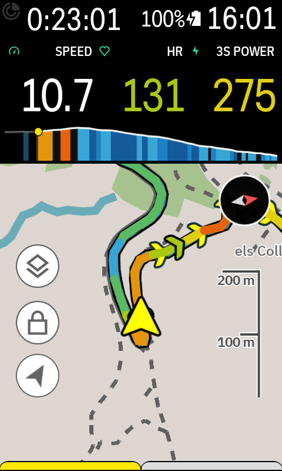
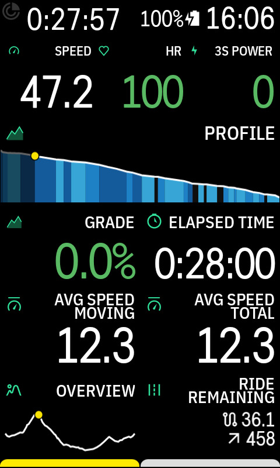
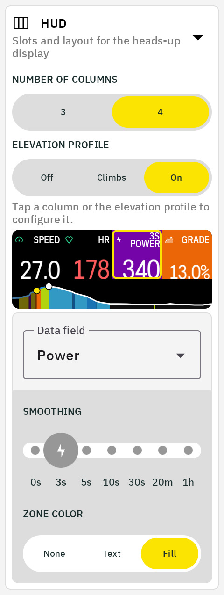

# HUD

The HUD puts three or four fields side by side in one cell, with the [elevation profile](elevation-profile.md) as a strip underneath. It is laid out for the map page, where the Karoo gives a single row of data the full width and a good deal of height: the numbers fill the width, and the profile takes the height they would leave empty.

On a data page the rows are shorter and the page has room of its own, so turn the strip off there and place the Profile field as a cell of its own instead.

<table>
  <tr>
    <td align="center">On the map page, with the profile strip below</td>
    <td align="center">On a data page, with Profile as a separate field</td>
  </tr>
  <tr>
    <td align="center" valign="top"></td>
    <td align="center" valign="top"></td>
  </tr>
</table>

## Slots

A slot holds power, heart rate, speed, cadence, grade, distance, time, or ETA, in the variants each comes in, from 3s Power to Lap Avg HR. Tap a column in the preview to pick its field and set its smoothing, zone coloring, and format, the same options as the standalone field ([every field and its options](data-fields.md)), kept per slot. Tap the strip to set the profile's mode and shape.

## Missing sensors

A slot whose sensor is not paired drops out, and the remaining columns widen to fill the cell, so a ride without the power meter shows a two-column HUD rather than a blank slot. The values resize to the wider columns. If every slot is missing its sensor, all of them stay, so the HUD never goes empty.

## The profile strip

The strip runs in one of three modes. On shows the profile whenever a route is loaded or you are riding to a destination. Climbs keeps it hidden until a climb nears, then [frames that climb foot to summit](gallery.md#climbs-mode). Off leaves the HUD as numbers only. Tapping the strip cycles 5, 10, or 20 km of lookahead, and its other settings are those of the Profile field ([shaping the profile](elevation-profile.md#shaping-the-profile)), kept separately.
