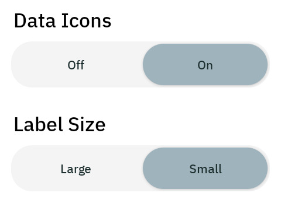
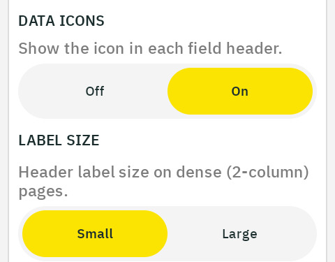

# Match Barberfish to your Karoo

Barberfish fields are built to sit beside the native ones without looking
out of place. Most of that happens on its own: the fields follow your
Karoo's light or dark theme, render in your metric or imperial units, and
color zones using the power and heart rate zones from your Karoo profile.

One group of settings cannot follow along. Karoo's Data Field Design
settings are not visible to extensions, so Barberfish keeps its own copy
of the two that shape how a field renders: Data Icons and Label Size.
Until they are mirrored, Barberfish fields can show icons the native
fields hide, or labels at a different size.

## Mirror the Data Field Design settings

1. On the Karoo, open the Data Field Design settings and note your choices
   for Data Icons and Label Size.
2. Open the Barberfish app, expand its Data Field Design section, and set
   DATA ICONS and LABEL SIZE to the same values.

<table>
  <tr>
    <td align="center">Karoo's Data Field Design settings</td>
    <td align="center">The same two settings in Barberfish</td>
  </tr>
  <tr>
    <td align="center"></td>
    <td align="center"></td>
  </tr>
</table>

Changes apply immediately, including mid-ride. Karoo's other Data Field
Design settings need no mirroring: they change the size and framing of the
cells themselves, which Barberfish adapts to automatically.
